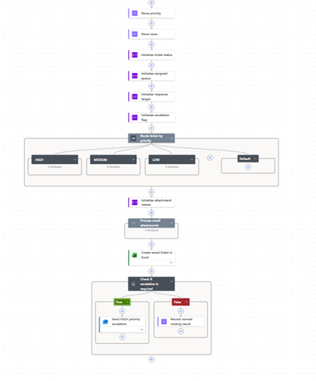
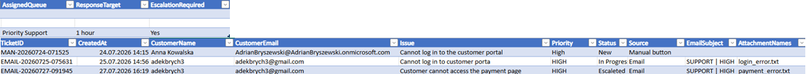
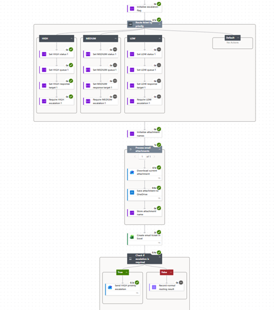
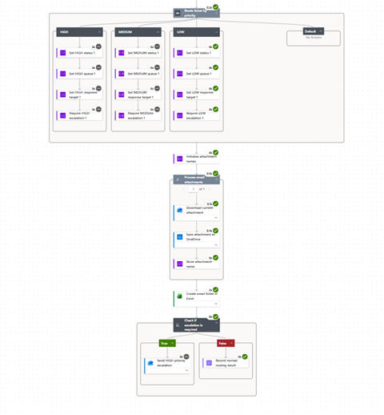

# D34 — Power Automate Conditions and Priority Routing

## Exercise goal

The goal of this exercise was to practise conditional logic in Microsoft Power Automate by extending Project 2 — Support Ticket Automation.

The exercise covered:

- Condition controls
- Switch controls
- multiple routing paths
- priority-based ticket assignment
- automatic escalation
- Outlook notifications
- successful branch analysis in flow run history

## Existing project context

The existing `P2 - Email Ticket Intake` flow:

1. Receives a support email.
2. Parses the email subject.
3. Downloads and saves attachments.
4. Creates a support ticket in Excel.

The D34 extension adds priority-based routing and escalation.

## Flow name

```text
P2 - Email Ticket Intake
```

## Priority-routing logic

The flow uses the parsed priority value to select a routing path.

| Priority | Status | Assigned queue | Response target | Escalation |
|---|---|---|---|---|
| HIGH | Escalated | Priority Support | 1 hour | Yes |
| MEDIUM | New | Standard Support | 8 hours | No |
| LOW | New | Backlog | 24 hours | No |
| Other | Needs Review | Manual Review | Not set | No |

## Switch control

The Switch control compares the parsed priority with the following cases:

```text
HIGH
MEDIUM
LOW
Default
```

Each case assigns values to routing variables:

```text
TicketStatus
AssignedQueue
ResponseTarget
EscalationRequired
```



## Excel ticket record

The Excel `SupportTickets` table was extended with:

```text
AssignedQueue
ResponseTarget
EscalationRequired
```

A HIGH-priority ticket is recorded as:

```text
Status: Escalated
AssignedQueue: Priority Support
ResponseTarget: 1 hour
EscalationRequired: Yes
```



## Condition control

After the ticket is created in Excel, a Condition checks:

```text
EscalationRequired is equal to Yes
```

### If yes

The flow sends an urgent Outlook notification containing:

- Ticket ID
- customer email
- issue
- priority
- assigned queue
- response target
- original email subject

### If no

The flow records that no escalation was required.

## HIGH-priority test

A test email was sent with the subject:

```text
SUPPORT | HIGH | Customer cannot access the payment page
```

The flow:

- selected the HIGH Switch case
- assigned the Priority Support queue
- set a one-hour response target
- marked the ticket as Escalated
- created the Excel record
- executed the `If yes` branch
- sent the urgent notification



## LOW-priority test

A second email was sent with the subject:

```text
SUPPORT | LOW | Request to update profile information
```

The flow:

- selected the LOW Switch case
- assigned the Backlog queue
- set a 24-hour response target
- created the Excel record
- executed the `If no` branch
- did not send an escalation email



## Condition vs Switch

A Condition is useful when the flow needs to make a yes-or-no decision.

Example:

```text
Does this ticket require escalation?
```

A Switch is useful when one value can lead to several possible paths.

Example:

```text
HIGH
MEDIUM
LOW
Default
```

## What works

- Email priorities are parsed from structured subject lines.
- The Switch control selects the correct priority case.
- HIGH tickets are routed to Priority Support.
- MEDIUM tickets are routed to Standard Support.
- LOW tickets are routed to the Backlog.
- Unknown priorities are sent to Manual Review.
- Ticket status and response targets are assigned automatically.
- Routing values are saved in Excel.
- HIGH-priority tickets trigger an urgent email notification.
- Non-HIGH tickets follow the non-escalation branch.
- Executed and skipped branches can be inspected in run history.

## What did not work

During configuration, newly added Excel columns might not immediately appear in Power Automate.

This is resolved by:

1. Saving and closing the Excel workbook.
2. Re-selecting the file and table in the Excel action.
3. Refreshing or recreating the action when necessary.

Priority values also need to match the Switch cases. The existing subject-parsing expression uses `trim()` and `toUpper()` to normalize the priority.

## Current limitations

- Priority must be included in the email subject.
- Only HIGH, MEDIUM and LOW are explicitly supported.
- Unknown values require manual review.
- Escalation currently sends an email only to one test recipient.
- There is no shared support mailbox or Microsoft Teams escalation.
- Response targets are labels and are not yet monitored as real SLA timers.
- The flow does not check whether a ticket has already been escalated.
- The flow does not yet send an automatic response to the customer.

## Planned improvements

Future versions may include:

- SLA deadline calculation
- Teams notifications
- shared mailbox notifications
- customer confirmation emails
- duplicate escalation prevention
- approval workflows
- status-change audit logs
- structured error handling
- automatic reassignment when an SLA is missed

## Key learning outcomes

This exercise provided practical experience with:

- Power Automate Conditions
- Power Automate Switch controls
- Case and Default routing
- workflow variables
- priority-based business rules
- Excel routing fields
- Outlook escalation notifications
- testing multiple execution branches
- run-history branch analysis