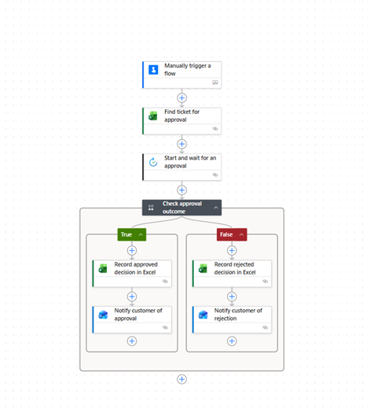
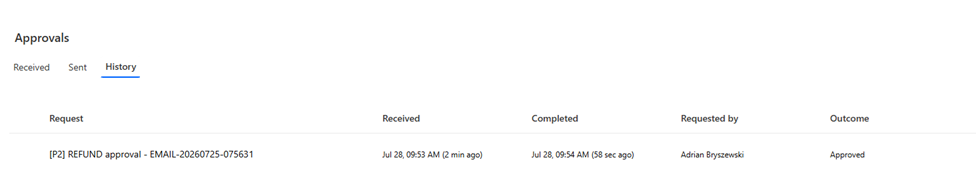
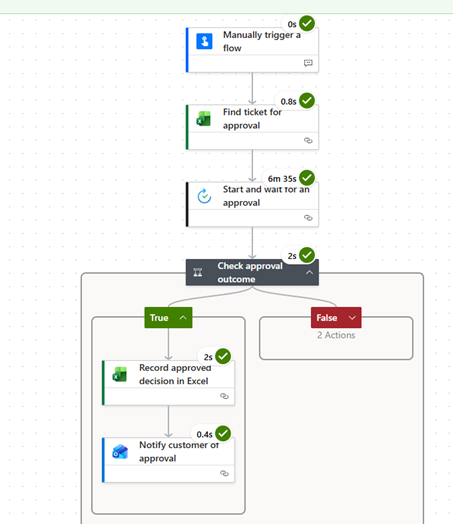
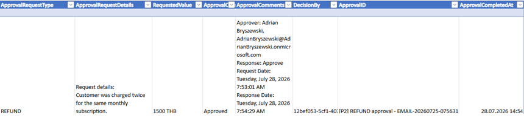
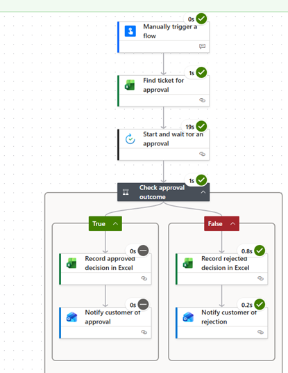

# D35 — Power Automate Approval Workflow

## Exercise goal

The goal of this exercise was to extend Project 2 — Support Ticket Automation with a human approval workflow for refund and access requests.

The exercise covered:

- manual approval-request input
- retrieval of an existing Excel ticket
- Power Automate Approvals
- Approve and Reject outcomes
- approval comments and decision metadata
- conditional processing
- Excel record updates
- customer notification emails
- approval run-history analysis

## Flow name

```text
P2 - Refund and Access Approval
```

## Business scenario

Some support actions should not be performed automatically.

Examples include:

- customer refunds
- elevated system access
- production-environment access
- account or billing exceptions

The approval flow adds a human decision before the requested action can proceed.

## Flow structure

```text
Enter approval request details
→ Find ticket in Excel
→ Start and wait for an approval
→ Check approval outcome
    → If approved: update Excel and notify customer
    → If rejected: update Excel and notify customer
```



## Approval-request inputs

The manually triggered flow accepts:

```text
Ticket ID
Request type
Requested value
Request details
```

The flow retrieves the original support-ticket information from the Excel `SupportTickets` table.

## Approval request

The approval request contains:

- Ticket ID
- request type
- requested refund value or access level
- customer email
- ticket priority
- original issue
- business justification

The approver can select:

```text
Approve
Reject
```

and provide decision comments.



## Approved request

The refund test used:

```text
Request type:
REFUND

Requested value:
1500 THB
```

The approver selected:

```text
Approve
```

and entered:

```text
Duplicate charge confirmed. Refund approved.
```

The flow then:

- executed the approval branch
- updated the existing Excel ticket
- recorded the decision metadata
- sent an approval notification to the customer



## Excel approval record

The Excel table stores:

```text
ApprovalRequestType
ApprovalRequestDetails
RequestedValue
ApprovalOutcome
ApprovalComments
DecisionBy
ApprovalID
ApprovalCompletedAt
```



## Rejected request

The access-request test used:

```text
Request type:
ACCESS

Requested value:
Administrator access to the CRM production environment
```

The approver selected:

```text
Reject
```

The flow then:

- executed the rejection branch
- updated the Excel ticket
- recorded the rejection comments
- sent a rejection notification to the customer



## What works

- An approval request can be created for an existing support ticket.
- Ticket details are retrieved from Excel.
- The approval is assigned to a specified Microsoft 365 user.
- The flow waits for the human decision.
- The approver can approve or reject the request.
- Approval comments are captured.
- The approver identity is recorded.
- The approval ID is retained for traceability.
- Approved and rejected requests execute separate branches.
- The existing Excel ticket is updated.
- The customer receives an email with the decision.
- Approval steps and branches can be inspected in run history.

## What did not work

The approval feature depends on the Power Automate environment and Microsoft Dataverse.

In environments without the required database, license or permissions, the approval action may not be available or might fail during provisioning.

Dynamic-content field names can also vary between designer versions. Approval response fields may appear as:

```text
Outcome
Responses Approval response
Responses Comments
Responses Approver name
Responses responder email
```

## Current limitations

- The approver is configured as one test Microsoft 365 account.
- The flow does not use a shared management group.
- Request types are entered as free text.
- Refund limits are not validated automatically.
- Access requests do not yet specify an expiry time.
- The flow does not perform the refund or grant access automatically.
- Approval reminders and escalation deadlines are not configured.
- There is no second-level approval for high-value refunds.
- The approval audit trail is stored in the main ticket table rather than a separate history table.

## Planned improvements

Future versions may include:

- fixed approver groups
- multiple approval levels
- manager approval for high-value refunds
- custom response options
- approval reminders
- timeout handling
- access-expiry dates
- automatic Teams notifications
- a separate approval-history table
- role-based access provisioning
- structured error handling

## Key learning outcomes

This exercise provided practical experience with:

- Power Automate Approvals
- Start and wait for an approval
- human-in-the-loop workflows
- approval outcomes
- approval comments and metadata
- conditional approval branches
- Excel row updates
- Outlook decision notifications
- business-process controls
- run-history analysis