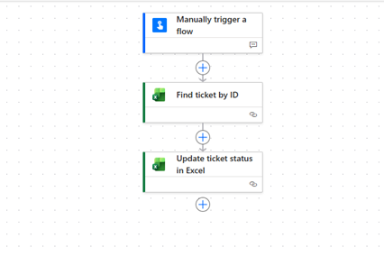

# D33 — Power Automate Excel Tables

## Exercise goal

The goal of this exercise was to practise Microsoft Power Automate operations with Excel Online tables.

The exercise covered:

- Excel Online table requirements
- adding records to tables
- retrieving a row by a key value
- updating an existing row
- key columns and key values
- successful flow-run analysis
- common Excel connector errors

## Existing project context

This exercise extends Project 2 — Support Ticket Automation.

Previous Project 2 flows already demonstrated:

- `List rows present in a table`
- `Add a row into a table`
- manual ticket creation
- email-based ticket creation
- Excel and Outlook integration

The D33 extension focuses primarily on updating an existing ticket.

## Flow name

```text
P2 - Update Ticket Status
```

## Flow purpose

The flow allows a user to enter:

- a Ticket ID
- a new ticket status
- a resolution note

Power Automate then finds the matching Excel row and updates the ticket.

## Flow structure

```text
Manually trigger a flow
→ Get a row
→ Update a row
```



## Excel table requirements

The workbook contains an Excel table named:

```text
SupportTickets
```

The most important columns for this flow are:

```text
TicketID
Status
ResolutionNote
UpdatedAt
```

`TicketID` is used as the key column.

Each ticket should have a unique Ticket ID so that the correct row can be identified and updated.

## Update operation

The flow uses the `Update a row` Excel Online action.

The update changes:

- `Status`
- `ResolutionNote`
- `UpdatedAt`

Other ticket fields remain unchanged.


## Successful test

The flow was tested with an existing Ticket ID.

Example update:

```text
Status:
In Progress

Resolution note:
Customer identity verified. Technical investigation started.
```

The run history confirmed that:

- the manual trigger accepted the update details
- the ticket was found using its Ticket ID
- the corresponding Excel row was updated successfully


## Controlled error

A controlled test was performed using an invalid Ticket ID:

```text
EMAIL-DOES-NOT-EXIST
```

The flow failed because no matching Excel row could be found.

The failed run history made it possible to inspect:

- the failed action
- the incorrect key value
- the connector error message


## What works

- The Excel workbook is stored in OneDrive for Business.
- Data is formatted as an Excel table.
- Power Automate can add new support tickets.
- A ticket can be retrieved using its Ticket ID.
- An existing ticket status can be updated.
- A resolution note can be recorded.
- The update time is generated automatically.
- Successful and failed runs are visible in run history.
- Invalid key values can be diagnosed through action inputs and errors.

## What did not work

The controlled test using a nonexistent Ticket ID failed because the key value did not match any row in the `SupportTickets` table.

The flow worked again after an existing Ticket ID was entered.

## Common Excel Online errors

### Table not found

Data must be formatted as an Excel table. A normal range of cells may not appear in Power Automate.

### Incorrect key column

The key column name must match the Excel header exactly.

Example:

```text
TicketID
```

### Incorrect key value

The key value must match an existing value in the selected column.

### Duplicate keys

Ticket IDs should be unique. Duplicate key values may cause the wrong row to be updated.

### File locking

The workbook should not be edited manually while Power Automate is writing data to it.

### Delayed updates

Excel changes may not appear immediately after a successful flow run.

## Current limitations

- New status is entered as free text.
- Status values are not validated.
- The flow does not yet send a confirmation notification.
- Duplicate Ticket IDs are not automatically prevented.
- Advanced error handling is not yet implemented.
- The flow does not yet record which user performed the update.

## Planned improvements

Future versions may include:

- a controlled list of allowed status values
- validation of Ticket ID before updating
- automatic update notifications
- conditional actions based on status
- structured error-handling scopes
- Teams notifications
- an audit-history table
- SharePoint List migration

## Key learning outcomes

This exercise provided practical experience with:

- Excel Online table requirements
- key columns and key values
- retrieving individual Excel rows
- updating existing records
- preserving unchanged data
- testing Excel connector actions
- diagnosing failed updates
- documenting successful and unsuccessful flow runs