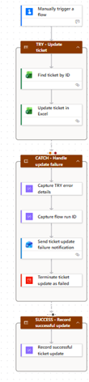

# D36 — Power Automate Error Handling

## Exercise goal

The goal of this exercise was to extend Project 2 — Support Ticket Automation with structured error handling.

The exercise covered:

- flow run-history analysis
- successful, failed and skipped actions
- action inputs and outputs
- retry policies
- Configure run after
- Try/Catch scopes
- failure notifications
- explicit flow termination

## Flow name

```text
P2 - Resilient Ticket Update
```

## Business scenario

A support-ticket update can fail because of:

- an invalid Ticket ID
- a temporarily unavailable connector
- expired authentication
- missing permissions
- a renamed or moved Excel file
- Excel locking or throttling
- incorrect action configuration

The resilient update flow handles these failures and notifies the flow owner.

## Flow structure

```text
Enter resilient ticket update

TRY - Update ticket
    Find ticket by ID
    Update ticket in Excel

CATCH - Handle update failure
    Capture error details
    Capture flow run ID
    Send failure notification
    Terminate as Failed

SUCCESS - Record successful update
    Record successful ticket update
```



## Retry policy

The Excel update action uses an exponential retry policy.

Example configuration:

```text
Retry policy: Exponential Interval
Retry count: 3
Minimum interval: PT10S
Maximum interval: PT1M
```

Retries are intended for temporary problems such as service unavailability, throttling or network errors.

Retries are not used for the `Get a row` action because retrying an invalid Ticket ID would not resolve the underlying data problem.


## Configure run after

The Catch scope is configured to run when the Try scope:

```text
has failed
has timed out
```

The Success scope runs when the Catch scope:

```text
is skipped
```

This creates two controlled execution paths.

### Successful path

```text
TRY: Succeeded
CATCH: Skipped
SUCCESS: Succeeded
```

### Failed path

```text
TRY: Failed
CATCH: Executed
SUCCESS: Not executed
```

## Successful test

The flow was tested with an existing Ticket ID.

The Excel ticket was updated successfully and the run history showed:

- a successful Try scope
- a skipped Catch scope
- a successful Success scope


## Controlled failure

A controlled test was performed using:

```text
EMAIL-DOES-NOT-EXIST
```

The `Find ticket by ID` action failed because the selected key value did not exist in the `SupportTickets` table.

The following Excel update action was skipped.


## Catch scope

After the Try scope failed, the Catch scope:

1. Captured the Try-scope action results.
2. Captured the flow run ID.
3. Sent a failure notification.
4. Terminated the flow with a Failed status.


## Failure notification

The error email contains:

- Ticket ID
- requested status
- resolution note
- flow run ID
- technical error details

This allows the flow owner to identify the affected request and locate the exact run in Power Automate.

## What works

- Existing tickets can be updated successfully.
- Related Excel operations are grouped in a Try scope.
- Failed Excel actions are visible in run history.
- Action inputs and error messages can be inspected.
- Temporary Excel update failures can be retried.
- Invalid Ticket IDs activate the Catch scope.
- Error details are captured from the Try scope.
- A failure notification is sent automatically.
- The flow is explicitly terminated with a Failed status.
- Successful and unsuccessful execution paths are clearly separated.

## What did not work

The controlled test using a nonexistent Ticket ID failed at:

```text
Find ticket by ID
```

The failure was expected because the key value did not match any row in the Excel table.

Retrying this action would not help because the problem is permanent until the input data is corrected.

## Retry vs error handling

Retry is appropriate for transient failures, including:

- throttling
- temporary service errors
- short network interruptions
- temporary connector timeouts

Retry is not appropriate for permanent failures, including:

- nonexistent Ticket IDs
- invalid expressions
- incorrect table names
- missing permissions
- deleted resources

After retries are exhausted, the Catch path can log and report the remaining failure.

## Common run-history statuses

### Succeeded

The action completed normally.

### Failed

The action attempted to run but encountered an error.

### Skipped

The action did not run because its run-after condition was not met or a previous dependent action failed.

### Timed out

The action did not complete within the allowed time.

## Current limitations

- Error notifications are sent to one test email address.
- Error details are included as technical JSON.
- Errors are not stored in a dedicated audit table.
- There is no automatic ticket-status update to `Automation Failed`.
- Retry settings are configured only for the Excel update action.
- The flow does not classify errors by HTTP status code.
- There is no Microsoft Teams alert.
- The flow does not automatically correct invalid input data.

## Planned improvements

Future versions may include:

- a separate error-log table
- human-readable error summaries
- error classification by status code
- Teams failure notifications
- automatic ticket failure status
- correlation IDs
- links directly to flow runs
- administrator escalation
- connection-health monitoring
- centralized error handling for all Project 2 flows

## Key learning outcomes

This exercise provided practical experience with:

- Power Automate run history
- action inputs and outputs
- failed and skipped actions
- retry policies
- exponential backoff
- Configure run after
- Scope controls
- Try/Catch patterns
- automated failure notifications
- explicit flow termination