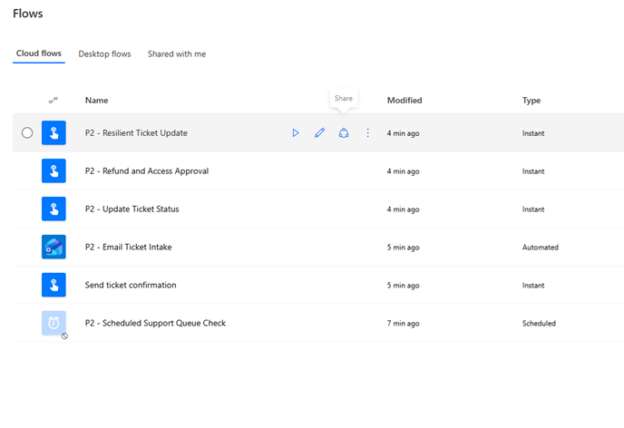

# D37 — Power Automate Project Documentation

## Exercise goal

The goal of this exercise was to create operational and technical documentation for Project 2 — Support Ticket Automation.

The documentation covers:

- flow purpose
- triggers and inputs
- business and technical outputs
- flow ownership
- dependencies and connections
- operational risks
- current limitations
- maintenance recommendations
- existing testing evidence

## Project owner

```text
Primary owner: Adrian Bryszewski
Environment: Personal Microsoft 365 development environment
Backup owner: Not configured — portfolio environment
```

For a production implementation, a controlled backup owner or service account should be considered to reduce dependency on one individual account.

## Project flow inventory

| Flow | Type | Purpose |
|---|---|---|
| P2 - Scheduled Support Queue Check | Scheduled | Periodically reads support tickets and sends a queue summary |
| P2 - Manual Test Ticket | Instant | Creates a test support ticket manually |
| P2 - Email Ticket Intake | Automated | Converts incoming emails into routed support tickets |
| P2 - Update Ticket Status | Instant | Updates an existing ticket using TicketID |
| P2 - Refund and Access Approval | Instant | Requests human approval for refund or access actions |
| P2 - Resilient Ticket Update | Instant | Updates tickets with structured error handling |



## Main business process

```text
Incoming support email
→ Parse ticket information
→ Generate TicketID
→ Determine priority
→ Assign queue and response target
→ Save attachment
→ Create Excel ticket
→ Check escalation requirement
→ Send notification when required
```

Separate supporting flows provide:

```text
manual ticket creation
scheduled queue checks
ticket-status updates
refund and access approvals
structured failure handling
```

## Main flow details

The primary automated flow is:

```text
P2 - Email Ticket Intake
```

### Purpose

Convert an incoming support email into a structured and routed support ticket.

### Trigger

```text
Office 365 Outlook — When a new email arrives
```

### Inputs

```text
Email sender
Email subject
Email body
Email attachment
```

The expected subject format is:

```text
SUPPORT | PRIORITY | ISSUE
```

### Outputs

```text
Generated TicketID
Parsed priority
Parsed issue
OneDrive attachment
Excel ticket row
Assigned support queue
Response target
Escalation decision
Optional urgent notification
```


## Supporting flows

### P2 - Scheduled Support Queue Check

**Purpose:** Periodically read the support-ticket table and send a status email.

**Inputs:**

```text
Schedule
Excel workbook
SupportTickets table
```

**Outputs:**

```text
Retrieved ticket records
Queue-status email
Run-history record
```

### P2 - Manual Test Ticket

**Purpose:** Create support tickets without requiring an incoming email.

**Inputs:**

```text
Customer name
Customer email
Issue
Priority
```

**Outputs:**

```text
Generated TicketID
Excel ticket row
Confirmation email
```

### P2 - Update Ticket Status

**Purpose:** Update an existing support ticket.

**Inputs:**

```text
Ticket ID
New status
Resolution note
```

**Outputs:**

```text
Updated Excel record
Update timestamp
Run-history result
```

### P2 - Refund and Access Approval

**Purpose:** Add human approval before a refund or privileged-access request can proceed.

**Inputs:**

```text
Ticket ID
Request type
Requested value or access
Request justification
Approver decision
Approver comments
```

**Outputs:**

```text
Approval outcome
Decision metadata
Updated Excel ticket
Customer notification
```

### P2 - Resilient Ticket Update

**Purpose:** Update an existing ticket while handling input and connector failures.

**Inputs:**

```text
Ticket ID
New status
Resolution note
```

**Successful outputs:**

```text
Updated Excel row
Succeeded TRY scope
Skipped CATCH scope
Succeeded SUCCESS scope
```

**Failed outputs:**

```text
Captured error details
Flow run ID
Failure notification
Explicit Failed status
```

## Connections and dependencies

| Dependency | Purpose |
|---|---|
| Microsoft 365 account | Ownership and authentication |
| Power Automate environment | Flow execution |
| Office 365 Outlook | Email intake and notifications |
| Excel Online for Business | Ticket storage and updates |
| OneDrive for Business | Workbook and attachment storage |
| Approvals | Human refund and access decisions |
| `Project2_Support_Tickets.xlsx` | Main project data source |
| `SupportTickets` table | Structured ticket records |

## Risk register

| Risk | Potential impact | Current control | Production recommendation |
|---|---|---|---|
| Invalid TicketID | Update failure | Try/Catch notification | Validate ID before update |
| Duplicate TicketID | Incorrect row updated | Generated identifiers | Enforce unique IDs |
| Excel schema changes | Broken field mapping | Documented columns | Apply change control |
| Workbook locking | Delayed or failed write | Retry policy | Use SharePoint or Dataverse |
| Invalid email subject | Parsing failure | Required format | Validate subject structure |
| Expired connection | Flow stops working | Run-history monitoring | Periodic connection review |
| Single owner | Loss of maintenance access | Documented ownership | Add controlled backup owner |
| Unavailable approver | Approval remains open | Visible running status | Add reminders and timeout |
| Personal data exposure | Privacy risk | Test data in portfolio | Mask PII in screenshots |
| Test notification recipient | Alert reaches only one person | Owner email configured | Use a shared mailbox or Teams |
| No enforced SLA | Delayed response | Routing labels | Calculate and monitor deadlines |
| No separate audit log | Limited change history | Run history and Excel fields | Create a separate history table |

## Testing and validation evidence

The individual Project 2 exercises contain screenshots and documentation confirming successful and unsuccessful execution paths.

### D33 — Excel table operations

Covered:

```text
Get a row
Update a row
Existing TicketID test
Invalid TicketID test
Excel run-history analysis
```

[Open D33 — Excel table operations](D33_power_automate_excel_tables.md)

### D34 — Conditions and priority routing

Covered:

```text
HIGH, MEDIUM and LOW Switch cases
Default routing
Escalation Condition
HIGH-priority notification
Non-escalation path
```

[Open D34 — Conditions and priority routing](D34_power_automate_conditions.md)

### D35 — Approval workflow

Covered:

```text
Refund approval
Access request
Approve branch
Reject branch
Excel decision record
Customer notification
```

[Open D35 — Approval workflow](D35_power_automate_approvals.md)

### D36 — Error handling

Covered:

```text
TRY, CATCH and SUCCESS scopes
Configure run after
Retry policy
Failed action inspection
Failure notification
Explicit Failed termination
```

[Open D36 — Error handling](D36_power_automate_error_handling.md)

These development logs provide sufficient evidence that the project flows were tested. A separate D37 health-check run was therefore not required.

## What works

- Six Project 2 cloud flows have defined business purposes.
- Flow names and action names describe their functions.
- Incoming emails can create structured support tickets.
- Attachments can be stored in OneDrive.
- Tickets can be created and updated in Excel.
- Tickets can be routed according to priority.
- HIGH-priority requests can generate escalation notifications.
- Refund and access requests can require human approval.
- Ticket-update failures can activate a Catch path.
- Successful and failed executions can be analysed in run history.
- Ownership, connections and dependencies are documented.
- Testing evidence is available in the D33–D36 development logs.

## Issues encountered during development

The following controlled or configuration issues occurred:

```text
Incorrect Excel table name
Invalid TicketID
Expressions inserted as plain text
Outlook sender field type mismatch
New Excel columns not immediately visible
Excel schema refresh problems
```

The issues were diagnosed using:

```text
run history
action inputs
action outputs
connector error messages
controlled negative-path tests
```

## Current limitations

- Excel is used as the operational data store.
- Email subjects must follow a specific format.
- Ticket IDs are not enforced by a database constraint.
- The project uses test email addresses and one primary owner.
- Approvals do not currently have reminders or timeouts.
- Response targets are descriptive labels rather than enforced SLAs.
- Errors are not stored in a separate audit database.
- The flow does not include automated customer identity verification.
- The project has not been deployed as a managed solution.
- Connections are associated with a personal development account.

## Maintenance checklist

The flow owner should periodically verify:

```text
Flow status
Connection status
Recent failed runs
Excel table structure
Notification recipients
Approval recipients
TicketID uniqueness
Test and production data separation
```

After any major flow change, at least one successful test and one relevant negative-path test should be completed.

## Production recommendations

A production version should consider:

- replacing Excel with SharePoint Lists or Dataverse
- using a shared mailbox
- adding a backup owner or service account
- storing errors in a dedicated audit table
- enforcing unique Ticket IDs
- validating incoming email subjects
- calculating real SLA deadlines
- adding approval reminders and timeouts
- using environment variables for recipients and file locations
- packaging flows inside a Power Platform solution

## Key learning outcomes

This exercise provided practical experience with:

- technical workflow documentation
- operational handover documentation
- purpose and scope definition
- input and output documentation
- flow ownership
- dependency mapping
- risk assessment
- maintenance planning
- documenting testing evidence
- creating production recommendations