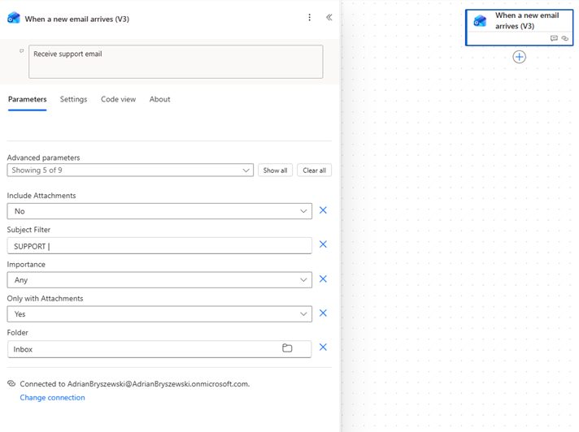
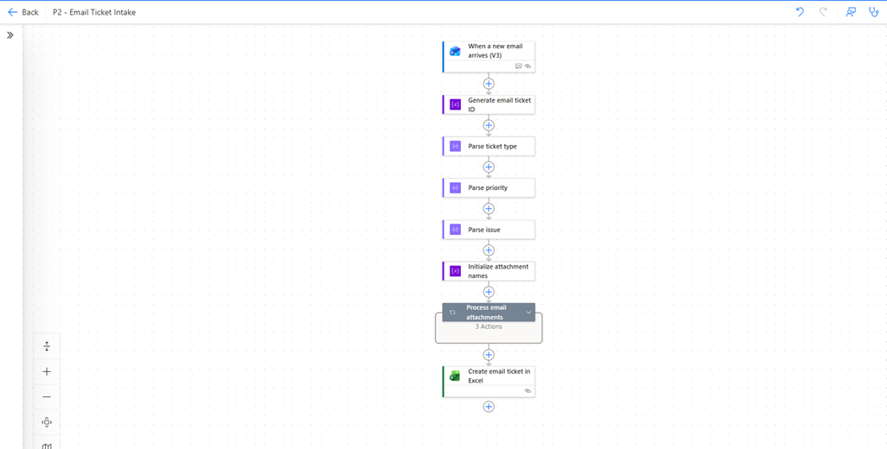
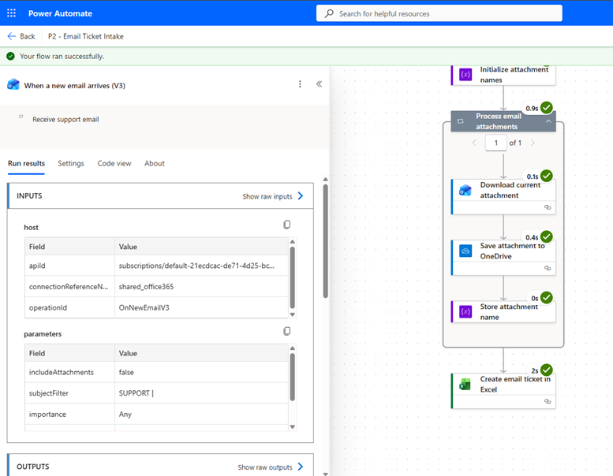

# Project 2 — Email Ticket Intake

## Project overview

This flow extends the Project 2 support-ticket automation by creating support tickets directly from incoming emails.

When a new support email with an attachment arrives, Microsoft Power Automate:

1. Detects the incoming email.
2. Parses the structured subject line.
3. Generates a unique ticket ID.
4. Downloads and saves the email attachments to OneDrive.
5. Records the attachment names.
6. Creates a support ticket in an Excel Online table.

## Tools used

- Microsoft Power Automate
- Office 365 Outlook
- OneDrive for Business
- Excel Online for Business

## Flow name

```text
P2 - Email Ticket Intake
```

## Email subject format

The flow expects the following subject format:

```text
SUPPORT | PRIORITY | ISSUE
```

Example:

```text
SUPPORT | HIGH | Cannot log in to customer portal
```

The subject is parsed into:

- Ticket type: `SUPPORT`
- Priority: `HIGH`
- Issue: `Cannot log in to customer portal`

## Flow structure

The flow contains:

- `When a new email arrives (V3)` trigger
- ticket ID generation
- subject parsing actions
- an attachment-processing loop
- `Get Attachment (V2)`
- OneDrive file creation
- attachment-name collection
- Excel ticket creation





## Attachment handling

Each email attachment is downloaded and saved in a dedicated OneDrive folder.

The generated ticket ID is added to the beginning of the filename to reduce the risk of duplicate filenames.

Example:

```text
EMAIL-20260725-093015-login_error.txt
```


## Excel ticket record

One Excel row is created for each incoming email.

The ticket record contains:

- ticket ID
- creation date
- sender name
- sender email address
- issue description
- priority
- ticket status
- source
- original email subject
- attachment names
- attachment folder
- Outlook message ID


## Successful run history

The successful run confirms that:

- the Outlook trigger detected the email
- the subject was parsed correctly
- the attachments were downloaded
- the files were saved to OneDrive
- one ticket record was created in Excel



## What works

- Incoming support emails start the flow automatically.
- Only emails containing attachments are processed.
- The subject line is split into ticket type, priority and issue.
- A unique ticket ID is generated.
- Multiple attachments can be processed in a loop.
- Attachments are saved to OneDrive.
- Attachment names are stored in one Excel field.
- One Excel support ticket is created per email.
- The original Outlook message ID is retained for traceability.
- Flow inputs and outputs can be inspected through run history.

## Current limitations

- The email subject must follow the required format.
- Incorrectly formatted subjects are not yet validated.
- Attachment file types are not yet restricted.
- Inline email images may be treated as attachments.
- High-priority tickets are not yet escalated automatically.
- Duplicate emails are not yet detected.
- Advanced error handling has not yet been implemented.

## Planned improvements

Future versions may include:

- subject-format validation
- conditions based on ticket priority
- automatic high-priority escalation
- approval workflows
- attachment-type validation
- duplicate message detection
- automatic confirmation emails
- structured error handling
- Teams notifications

## Key learning outcomes

This exercise provided practical experience with:

- automated cloud-flow triggers
- Outlook email triggers
- email attachment processing
- Apply to each loops
- OneDrive file creation
- Power Automate string expressions
- subject-line parsing
- dynamic content
- Excel table integration
- run-history analysis
```