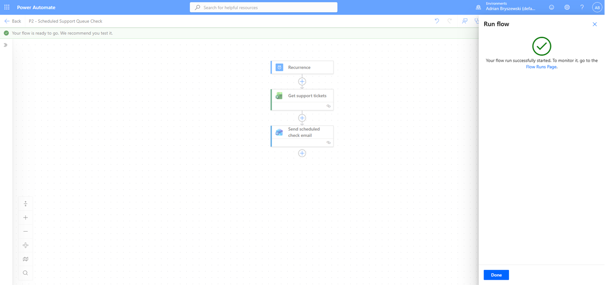
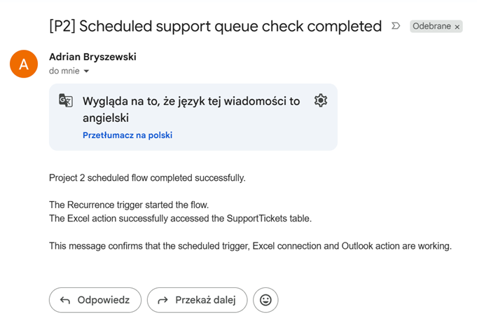
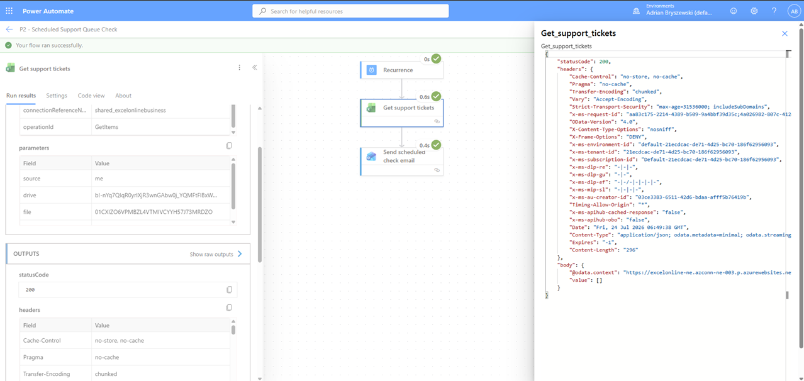
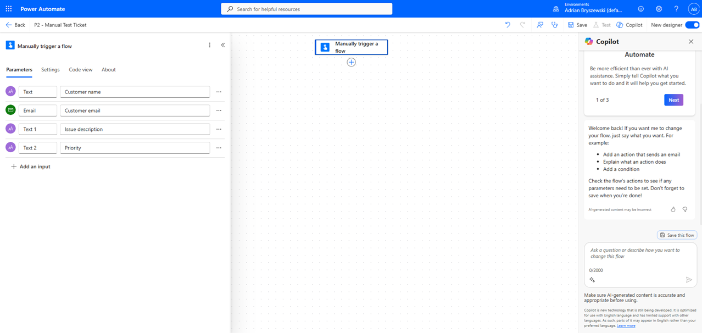
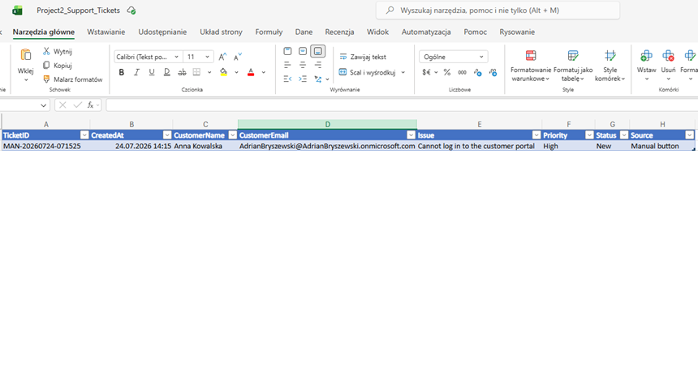
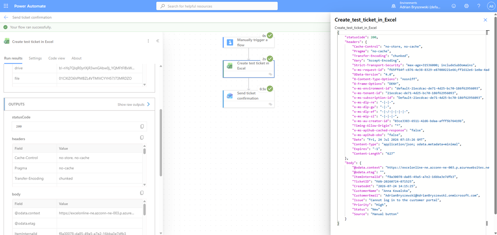
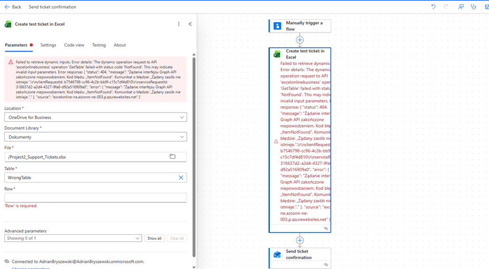

# Project 2 — Recurring and Instant Support Flows

## Project overview

This project demonstrates two Microsoft Power Automate cloud flows created for a simple support-ticket workflow:

1. A scheduled flow that checks an Excel support-ticket table and sends a confirmation email.
2. An instant flow that manually creates a test support ticket in Excel.

The exercise focused on:

- recurring and scheduled cloud flows
- instant and button-triggered flows
- triggers versus actions
- Excel Online integration
- email notifications
- flow run history
- testing and troubleshooting

---

## Tools used

- Microsoft Power Automate
- Excel Online for Business
- OneDrive for Business
- Office 365 Outlook

---

## Support ticket data

Both flows use an Excel table named:

```text
SupportTickets
```

The table contains the following fields:

- Ticket ID
- Created date
- Customer name
- Customer email
- Issue description
- Priority
- Status
- Source

---

# Flow 1 — Scheduled Support Queue Check

## Flow name

```text
P2 - Scheduled Support Queue Check
```

## Trigger

```text
Recurrence
```

The recurrence trigger starts the flow automatically according to a configured schedule.

During testing, the flow was configured to run every few minutes. After successful testing, the schedule can be changed to one run per day.

## Actions

The scheduled flow performs the following actions:

1. Reads rows from the `SupportTickets` Excel table.
2. Sends a confirmation email after the table has been accessed successfully.

## Flow structure

The complete scheduled flow contains:

- Recurrence trigger
- Excel action
- Email action



## Email confirmation

After a successful run, the flow sends an email confirming that the scheduled support queue check was completed.



## Successful run history

The flow run history confirms that:

- the recurrence trigger started successfully
- the Excel table was accessed successfully
- the confirmation email was sent successfully



---

# Flow 2 — Manual Test Ticket

## Flow name

```text
P2 - Manual Test Ticket
```

## Trigger

```text
Manually trigger a flow
```

The flow is started manually using the Power Automate test button.

## Trigger inputs

The manual trigger accepts the following information:

- Customer name
- Customer email
- Issue description
- Priority



## Actions

The instant flow performs the following actions:

1. Generates a unique test ticket ID.
2. Adds a new ticket to the Excel table.
3. Records the ticket creation date and time.
4. Sets the ticket status to `New`.
5. Sets the ticket source to `Manual button`.
6. Sends an email confirming that the ticket was created.

## Ticket created in Excel

The flow successfully added a new support ticket to the `SupportTickets` table.

The created row includes:

- generated ticket ID
- creation date and time
- customer details
- issue description
- priority
- status
- ticket source



## Successful instant flow run

The successful run history confirms that:

- the manual trigger received the input data
- the Excel action created a new row
- the email action completed successfully



---

# Trigger vs action

A trigger defines when and why a flow starts.

Triggers used in this project:

```text
Recurrence
Manually trigger a flow
```

An action defines what the flow does after it has started.

Actions used in this project:

```text
List rows present in a table
Add a row into a table
Send an email (V2)
```

Example:

```text
Trigger:
A user manually starts the flow.

Actions:
Power Automate creates an Excel row and sends an email.
```

---

# Troubleshooting exercise

A controlled error was created by configuring the Excel action with an incorrect table name.

The incorrect table name was:

```text
WrongTable
```

Because the table did not exist, the Excel action failed.

The run history showed that:

- the manual trigger succeeded
- the Excel action failed
- the email action did not run because the previous action failed



## How the issue was diagnosed

The failed run was opened in Power Automate run history.

The red Excel action showed that Power Automate could not find or access the selected table. The action inputs and error message helped identify the incorrect table configuration.

## Fix

The Excel action was corrected by selecting the existing table:

```text
SupportTickets
```

After saving the corrected flow and testing it again, the complete instant flow finished successfully.

---

# What works

- The scheduled trigger starts the flow automatically.
- The scheduled flow accesses the Excel support-ticket table.
- The scheduled flow sends an email confirmation.
- The manual trigger accepts ticket information.
- The instant flow creates a new Excel ticket.
- A unique ticket ID is generated automatically.
- The creation date and time are added automatically.
- The ticket status and source are assigned automatically.
- The instant flow sends an email confirmation.
- Successful and failed runs are visible in run history.
- Inputs and outputs can be inspected for individual actions.
- Run history can be used to diagnose configuration errors.

---

# What did not work

A controlled test failed after the Excel table name was changed from `SupportTickets` to `WrongTable`.

The trigger completed successfully, but the Excel action failed because the selected table did not exist. As a result, the following email action was not executed.

The issue was identified through the failed flow run history and fixed by selecting the correct Excel table.

---

# Current limitations

- Priority is entered as free text.
- Empty trigger inputs are not yet validated.
- The scheduled flow does not yet filter tickets by status.
- The scheduled email does not yet include a detailed ticket summary.
- The flow does not automatically notify a support team about high-priority tickets.
- Advanced error handling has not yet been added.
- The Excel file may experience locking issues during simultaneous editing.

---

# Possible future improvements

The project can be expanded by adding:

- validation of required fields
- a priority dropdown instead of free text
- automatic escalation for high-priority tickets
- filtering for open or unresolved tickets
- daily summaries of support-ticket volume
- conditions based on ticket priority
- error-handling scopes
- automatic retry logic
- Microsoft Teams notifications
- SharePoint List integration
- Power BI reporting

---

# Key learning outcomes

This exercise provided practical experience with:

- scheduled cloud flows
- instant cloud flows
- manual input fields
- triggers and actions
- Excel Online connectors
- Outlook email actions
- dynamic content
- Power Automate expressions
- flow testing
- successful run history
- failed run analysis
- troubleshooting Power Automate flows

---

# Screenshot structure

```text
screenshots/
├── 01_scheduled_flow_designer.png
├── 02_scheduled_email_received.png
├── 03_scheduled_run_history_success.png
├── 04_instant_manual_trigger_inputs.png
├── 05_instant_ticket_created_in_excel.png
├── 06_instant_run_history_success.png
└── 07_instant_run_history_failed.png
```
