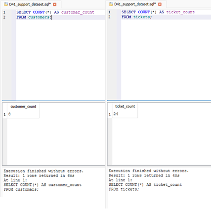
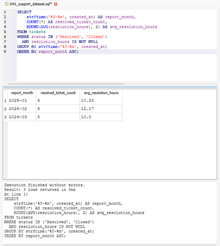
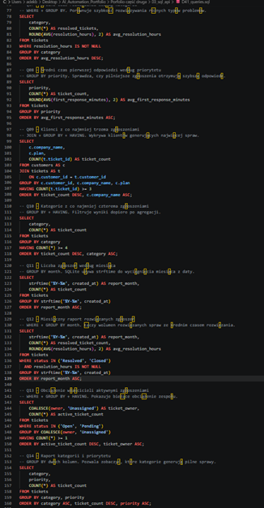

# D41 — SQL Support Reporting Practice

## Project overview

This project demonstrates practical SQL reporting skills in a SaaS and IT Support environment.

I created and analyzed a relational SQLite dataset containing customer accounts and support tickets. The exercise focused on writing operational reports that could help a support team monitor ticket volume, priorities, ownership, response times and resolution performance.

The project includes 15 SQL queries using:

* `SELECT`
* `WHERE`
* `JOIN`
* `GROUP BY`
* `HAVING`
* `ORDER BY`
* `COUNT`
* `AVG`
* `ROUND`
* `COALESCE`
* date grouping with `strftime`

## Repository structure

```text
03_sql_api/
├── D41_support.db
├── D41_support_dataset.sql
├── D41_queries.sql
├── D41_sql_support_reporting_practice.md
└── screenshots/
    ├── D41_01_database_setup.png
    ├── D41_02_monthly_report.png
    └── D41_03_all_queries.png
```

## Tools used

* SQLite
* DB Browser for SQLite
* SQLBolt
* W3Schools SQL
* Visual Studio Code
* Git and GitHub

## Dataset

The database contains two related tables:

* `customers`
* `tickets`

The dataset includes:

* 8 customers
* 24 support tickets
* 5 ticket categories
* 4 priority levels
* 4 support owners
* tickets created between January and March 2026

## Database schema

### Customers table

| Column         | Description                |
| -------------- | -------------------------- |
| `customer_id`  | Unique customer identifier |
| `company_name` | Customer company name      |
| `plan`         | Subscription plan          |
| `country`      | Customer country           |
| `signup_date`  | Account registration date  |

### Tickets table

| Column                   | Description                                  |
| ------------------------ | -------------------------------------------- |
| `ticket_id`              | Unique support ticket identifier             |
| `customer_id`            | Customer identifier used to join both tables |
| `category`               | Type of support request                      |
| `priority`               | Ticket priority                              |
| `status`                 | Current ticket status                        |
| `owner`                  | Support agent responsible for the ticket     |
| `created_at`             | Ticket creation date                         |
| `resolved_at`            | Ticket resolution date                       |
| `first_response_minutes` | Time before the first support response       |
| `resolution_hours`       | Total ticket resolution time                 |
| `subject`                | Short description of the issue               |

## Database setup verification

The database was successfully created with both required tables.

```sql
SELECT name
FROM sqlite_master
WHERE type = 'table'
ORDER BY name;
```

Result:

```text
customers
tickets
```

The record counts were verified with:

```sql
SELECT COUNT(*) AS customer_count
FROM customers;

SELECT COUNT(*) AS ticket_count
FROM tickets;
```

Result:

```text
customers: 8
tickets: 24
```



---

# SQL reports

## Query 1 — Complete support queue

```sql
SELECT
    ticket_id,
    subject,
    category,
    priority,
    status,
    owner,
    created_at
FROM tickets
ORDER BY created_at ASC;
```

This query displays the complete support queue, ordered from the oldest ticket to the newest.

---

## Query 2 — Active high-priority tickets

```sql
SELECT
    ticket_id,
    subject,
    priority,
    status,
    owner
FROM tickets
WHERE status IN ('Open', 'Pending')
  AND priority IN ('High', 'Critical')
ORDER BY
    CASE priority
        WHEN 'Critical' THEN 1
        WHEN 'High' THEN 2
        ELSE 3
    END,
    created_at ASC;
```

This query identifies unresolved `Critical` and `High` priority tickets.

The result helps support teams decide which issues should be handled first.

---

## Query 3 — Tickets with customer information

```sql
SELECT
    t.ticket_id,
    c.company_name,
    c.plan,
    c.country,
    t.subject,
    t.category,
    t.priority,
    t.status
FROM tickets AS t
JOIN customers AS c
    ON t.customer_id = c.customer_id
ORDER BY t.ticket_id;
```

This query combines ticket data with customer information.

It demonstrates how an SQL `JOIN` can provide additional business context, such as the customer company, subscription plan and country.

---

## Query 4 — Ticket volume by category

```sql
SELECT
    category,
    COUNT(*) AS ticket_count
FROM tickets
GROUP BY category
ORDER BY ticket_count DESC, category ASC;
```

Result:

| Category    | Ticket count |
| ----------- | -----------: |
| Login       |            6 |
| API         |            5 |
| Billing     |            5 |
| Account     |            4 |
| Integration |            4 |

`Login` was the most common support category, with 6 tickets.

---

## Query 5 — Ticket volume by priority

```sql
SELECT
    priority,
    COUNT(*) AS ticket_count
FROM tickets
GROUP BY priority
ORDER BY ticket_count DESC, priority ASC;
```

Result:

| Priority | Ticket count |
| -------- | -----------: |
| High     |            9 |
| Medium   |            6 |
| Critical |            5 |
| Low      |            4 |

`High` was the most common priority level, with 9 tickets.

---

## Query 6 — Ticket ownership distribution

```sql
SELECT
    COALESCE(owner, 'Unassigned') AS ticket_owner,
    COUNT(*) AS ticket_count
FROM tickets
GROUP BY COALESCE(owner, 'Unassigned')
ORDER BY ticket_count DESC, ticket_owner ASC;
```

Result:

| Owner      | Ticket count |
| ---------- | -----------: |
| Anna       |            6 |
| Bartek     |            6 |
| Daniel     |            6 |
| Celina     |            5 |
| Unassigned |            1 |

Anna, Bartek and Daniel each handled 6 tickets.

The `COALESCE` function was used to replace missing owner values with `Unassigned`.

---

## Query 7 — Average resolution time by category

```sql
SELECT
    category,
    COUNT(*) AS resolved_tickets,
    ROUND(AVG(resolution_hours), 2) AS avg_resolution_hours
FROM tickets
WHERE resolution_hours IS NOT NULL
GROUP BY category
ORDER BY avg_resolution_hours DESC;
```

Result:

| Category    | Resolved tickets | Average resolution time |
| ----------- | ---------------: | ----------------------: |
| Integration |                3 |             20.67 hours |
| Billing     |                4 |             13.75 hours |
| Account     |                4 |              9.75 hours |
| Login       |                3 |              6.33 hours |
| API         |                3 |              3.17 hours |

`Integration` tickets had the highest average resolution time at 20.67 hours.

This result suggests that integration issues may require more complex troubleshooting or cooperation with external systems.

---

## Query 8 — Average first response time by priority

```sql
SELECT
    priority,
    COUNT(*) AS ticket_count,
    ROUND(AVG(first_response_minutes), 2) AS avg_first_response_minutes
FROM tickets
GROUP BY priority
ORDER BY avg_first_response_minutes ASC;
```

Result:

| Priority | Average first response |
| -------- | ---------------------: |
| Critical |           5.00 minutes |
| High     |          16.89 minutes |
| Medium   |          43.33 minutes |
| Low      |          78.75 minutes |

Critical and High priority tickets received substantially faster first responses than Medium and Low priority tickets.

This indicates that ticket prioritization was reflected in the support team's response performance.

---

## Query 9 — Customers with at least three tickets

```sql
SELECT
    c.company_name,
    c.plan,
    COUNT(t.ticket_id) AS ticket_count
FROM customers AS c
JOIN tickets AS t
    ON c.customer_id = t.customer_id
GROUP BY
    c.customer_id,
    c.company_name,
    c.plan
HAVING COUNT(t.ticket_id) >= 3
ORDER BY ticket_count DESC, c.company_name ASC;
```

Result:

| Customer           | Plan       | Ticket count |
| ------------------ | ---------- | -----------: |
| Northstar Labs     | Enterprise |            4 |
| BlueWave Travel    | Enterprise |            3 |
| BrightPath Academy | Basic      |            3 |
| GreenBox Retail    | Pro        |            3 |
| NovaCare Health    | Pro        |            3 |
| Orbit Finance      | Enterprise |            3 |
| UrbanNest          | Pro        |            3 |

Northstar Labs generated the largest number of tickets, with 4 support requests.

The `HAVING` clause was used because the filtering condition depends on an aggregated value.

---

## Query 10 — Categories with at least four tickets

```sql
SELECT
    category,
    COUNT(*) AS ticket_count
FROM tickets
GROUP BY category
HAVING COUNT(*) >= 4
ORDER BY ticket_count DESC, category ASC;
```

This query returns only categories that generated at least four support tickets.

All five categories met this condition in the current dataset.

---

## Query 11 — Monthly ticket volume

```sql
SELECT
    strftime('%Y-%m', created_at) AS report_month,
    COUNT(*) AS ticket_count
FROM tickets
GROUP BY strftime('%Y-%m', created_at)
ORDER BY report_month ASC;
```

Result:

| Month   | Ticket count |
| ------- | -----------: |
| 2026-01 |            8 |
| 2026-02 |            8 |
| 2026-03 |            8 |

Ticket volume remained stable across all three months.

Each month contained 8 newly created support tickets.

---

## Query 12 — Monthly resolved ticket report

```sql
SELECT
    strftime('%Y-%m', created_at) AS report_month,
    COUNT(*) AS resolved_ticket_count,
    ROUND(AVG(resolution_hours), 2) AS avg_resolution_hours
FROM tickets
WHERE status IN ('Resolved', 'Closed')
  AND resolution_hours IS NOT NULL
GROUP BY strftime('%Y-%m', created_at)
ORDER BY report_month ASC;
```

Result:

| Month   | Resolved tickets | Average resolution time |
| ------- | ---------------: | ----------------------: |
| 2026-01 |                6 |             10.25 hours |
| 2026-02 |                6 |             12.17 hours |
| 2026-03 |                5 |             10.00 hours |

February had the highest average resolution time at 12.17 hours.

March had the lowest number of resolved or closed tickets.



---

## Query 13 — Active ticket workload by owner

```sql
SELECT
    COALESCE(owner, 'Unassigned') AS ticket_owner,
    COUNT(*) AS active_ticket_count
FROM tickets
WHERE status IN ('Open', 'Pending')
GROUP BY COALESCE(owner, 'Unassigned')
HAVING COUNT(*) >= 1
ORDER BY active_ticket_count DESC, ticket_owner ASC;
```

Result:

| Owner      | Active tickets |
| ---------- | -------------: |
| Anna       |              2 |
| Celina     |              2 |
| Bartek     |              1 |
| Daniel     |              1 |
| Unassigned |              1 |

Anna and Celina had the largest active workloads, with 2 unresolved tickets each.

One active ticket remained unassigned.

---

## Query 14 — Ticket count by category and priority

```sql
SELECT
    category,
    priority,
    COUNT(*) AS ticket_count
FROM tickets
GROUP BY category, priority
ORDER BY category ASC, ticket_count DESC, priority ASC;
```

This query groups the support queue by two dimensions: category and priority.

Important findings included:

* all 5 API tickets were classified as `Critical`,
* all 4 Integration tickets were classified as `High`,
* Login issues appeared across multiple priority levels.

This type of report could help identify categories that regularly generate urgent incidents.

---

## Query 15 — Owners with slower average resolution times

```sql
SELECT
    owner,
    COUNT(*) AS resolved_ticket_count,
    ROUND(AVG(resolution_hours), 2) AS avg_resolution_hours
FROM tickets
WHERE owner IS NOT NULL
  AND resolution_hours IS NOT NULL
GROUP BY owner
HAVING COUNT(*) >= 2
   AND AVG(resolution_hours) > 8
ORDER BY avg_resolution_hours DESC;
```

Result:

| Owner  | Resolved tickets | Average resolution time |
| ------ | ---------------: | ----------------------: |
| Daniel |                5 |             14.60 hours |
| Bartek |                5 |             12.60 hours |
| Anna   |                4 |              9.75 hours |

Daniel had the highest average resolution time at 14.60 hours.

However, this result should not automatically be interpreted as poor individual performance. The difference may be caused by the complexity and categories of tickets assigned to each owner.



---

# Key business findings

## Ticket demand

The largest number of support requests was related to Login issues.

This suggests that authentication, password recovery, session management and account access should receive additional attention in product documentation and self-service support resources.

## Priority distribution

High priority tickets represented the largest group in the dataset.

A real support manager could use this information to verify whether priority levels are being assigned correctly or whether too many issues are being classified as urgent.

## Support workload

Anna, Bartek and Daniel each handled 6 tickets, while Celina handled 5.

The overall ticket distribution was relatively balanced, although the active workload report showed that Anna and Celina had more unresolved work at the time of analysis.

## Response performance

The average first response time increased as ticket priority decreased:

* Critical: 5.00 minutes
* High: 16.89 minutes
* Medium: 43.33 minutes
* Low: 78.75 minutes

This indicates that the support process correctly prioritized urgent requests.

## Resolution performance

Integration issues required the longest average resolution time.

These tickets may involve:

* external APIs,
* third-party systems,
* authentication configuration,
* data synchronization,
* vendor dependencies,
* complex reproduction steps.

## Monthly performance

Ticket volume remained stable at 8 tickets per month.

The average resolution time was highest in February at 12.17 hours, compared with 10.25 hours in January and 10 hours in March.

## Customer support demand

Northstar Labs generated the highest number of support tickets.

Customers with repeated support requests could be reviewed for:

* onboarding gaps,
* product configuration issues,
* missing documentation,
* training requirements,
* recurring technical problems.

# Skills demonstrated

This project demonstrates practical experience with:

* SQL
* SQLite
* relational database concepts
* filtering data with `WHERE`
* joining related tables
* grouping and aggregating records
* filtering aggregate results with `HAVING`
* ordering operational reports
* handling null values with `COALESCE`
* calculating averages and record counts
* grouping records by month
* SaaS support reporting
* customer support analytics
* ticket workload analysis
* response and resolution metrics
* technical documentation
* GitHub portfolio management

# Project outcome

I created a relational support dataset and developed 15 SQL reports for analyzing ticket volume, customer activity, support ownership, ticket priority, first response time, resolution time and monthly support performance.

The project demonstrates how SQL can be used by SaaS Support, Technical Support and Customer Success teams to convert operational ticket data into actionable business information.

