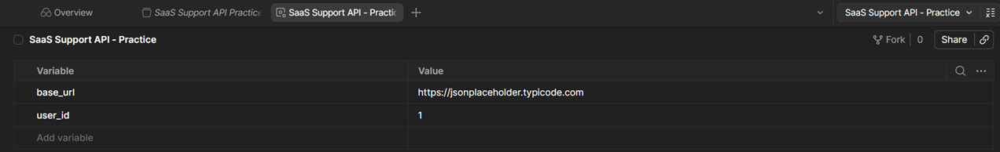
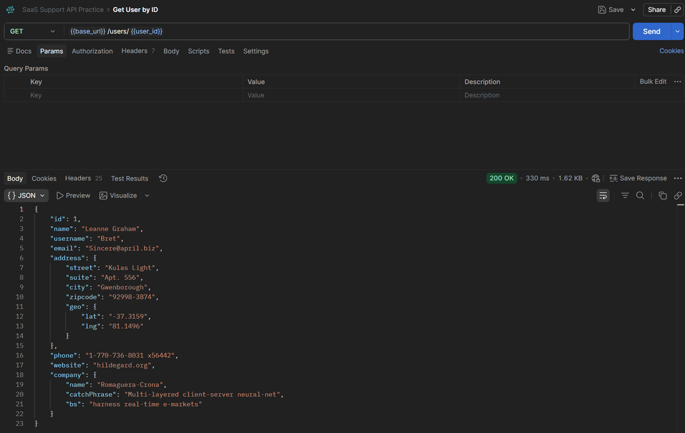

# D43 — Postman Collections, Environments and Variables

## Objective

The goal of this exercise was to practise reusable API requests in Postman using collections, environments and environment variables.

Instead of hardcoding API URLs and identifiers directly in each request, I created reusable variables:

- `base_url`
- `user_id`

The exercise demonstrates how the same request structure can be reused by changing environment values rather than editing every request manually.

## Repository location

```text
03_sql_api/
└── learning/
    └── api/
        ├── D43_postman_environment_variables.md
        └── screenshots/
            ├── D43_01_environment_variables.png
            └── D43_02_requests_using_variables.png
```

## Tools

- Postman
- JSONPlaceholder public REST API
- GitHub
- Markdown

## Concepts reviewed

### Collections

Postman Collections group related API requests in one reusable location.

For this exercise, the requests were organized in a collection named:

```text
SaaS Support API Practice
```

### Environments

A Postman environment stores values that can change between contexts.

Typical examples include:

- development API URL,
- staging API URL,
- production API URL,
- user IDs,
- API keys,
- access tokens.

### Variables

Postman variables can be referenced using double curly braces.

Example:

```text
{{base_url}}
{{user_id}}
```

The final request URL can therefore be written as:

```text
{{base_url}}/users/{{user_id}}
```

instead of:

```text
https://jsonplaceholder.typicode.com/users/1
```

### HTTP methods

The exercise reviewed the purpose of common HTTP methods:

| Method | Typical purpose |
|---|---|
| GET | Read data |
| POST | Create data |
| PUT | Replace a resource |
| PATCH | Partially update a resource |
| DELETE | Delete a resource |

### Status codes

Important status-code groups:

| Range | Meaning |
|---|---|
| 2xx | Successful request |
| 3xx | Redirection |
| 4xx | Client-side error |
| 5xx | Server-side error |

Common examples include:

- `200 OK`
- `201 Created`
- `400 Bad Request`
- `401 Unauthorized`
- `403 Forbidden`
- `404 Not Found`
- `500 Internal Server Error`

### Authentication basics

Common API authentication methods include:

- No Auth
- API Key
- Basic Auth
- Bearer Token
- OAuth 2.0

JSONPlaceholder is a public training API, so the requests in this exercise use `No Auth`.

---

# Environment configuration

I created an environment named:

```text
SaaS Support API - Practice
```

with the following variables:

| Variable | Value |
|---|---|
| `base_url` | `https://jsonplaceholder.typicode.com` |
| `user_id` | `1` |

The environment was selected as the active Postman environment before sending requests.



---

# Request 1 — Get a user using variables

## Method

```text
GET
```

## URL

```text
{{base_url}}/users/{{user_id}}
```

With the active environment, Postman resolves this to:

```text
https://jsonplaceholder.typicode.com/users/1
```

## Expected status

```text
200 OK
```

## Purpose

This request demonstrates the use of two environment variables inside the request URL.

---

# Request 2 — Get posts for the selected user

## Method

```text
GET
```

## URL

```text
{{base_url}}/posts?userId={{user_id}}
```

## Expected status

```text
200 OK
```

## Purpose

This request demonstrates using an environment variable as a query-parameter value.

Changing `user_id` in the environment automatically changes which user's posts are returned without modifying the saved request.

---

# Request 3 — Create a test post

## Method

```text
POST
```

## URL

```text
{{base_url}}/posts
```

## Headers

```text
Content-Type: application/json
```

## Body

```json
{
  "title": "Support API variable practice",
  "body": "Created from a Postman request using an environment variable.",
  "userId": {{user_id}}
}
```

## Expected status

```text
201 Created
```

## Purpose

This request demonstrates that environment variables can also be used inside a JSON request body.

JSONPlaceholder simulates the creation of the resource but does not permanently store it.

---

# Variable reuse test

To verify that the requests were truly reusable, I changed:

```text
user_id = 1
```

to:

```text
user_id = 2
```

I then sent the saved requests again without editing their URLs.

Postman automatically resolved:

```text
{{user_id}}
```

to the new value.

This demonstrates why environments are useful when the same request collection needs to work with different:

- users,
- servers,
- accounts,
- test datasets,
- environments.



---

# Business relevance

Environment variables make API support and testing workflows easier to maintain.

Without variables, an agent or tester may repeatedly hardcode values such as:

```text
https://api.example.com
12345
```

into multiple requests.

Using:

```text
{{base_url}}
{{user_id}}
```

makes the request collection reusable and reduces manual editing.

This is useful when troubleshooting:

- different customer accounts,
- staging and production environments,
- different API hosts,
- multiple test users,
- different authentication tokens.

---

# Key lessons

During this exercise, I learned how to:

- organize requests in a Postman Collection,
- create and activate a Postman environment,
- create environment variables,
- reference variables with `{{variable_name}}`,
- use variables in URL paths,
- use variables in query parameters,
- use variables in JSON request bodies,
- send GET and POST requests,
- interpret HTTP status codes,
- understand basic API authentication options,
- reuse the same request with different environment values.

---

# Completion checklist

- [ ] Created or reused the `SaaS Support API Practice` collection.
- [ ] Created the `SaaS Support API - Practice` environment.
- [ ] Added `base_url`.
- [ ] Added `user_id`.
- [ ] Activated the environment.
- [ ] Sent `GET {{base_url}}/users/{{user_id}}`.
- [ ] Sent `GET {{base_url}}/posts?userId={{user_id}}`.
- [ ] Sent `POST {{base_url}}/posts`.
- [ ] Received expected `200` and `201` responses.
- [ ] Changed `user_id` and reused the requests without editing their URLs.
- [ ] Added two screenshots.
- [ ] Added this Markdown document to GitHub.

## Git commit

```text
Complete Postman environment variables practice
```
