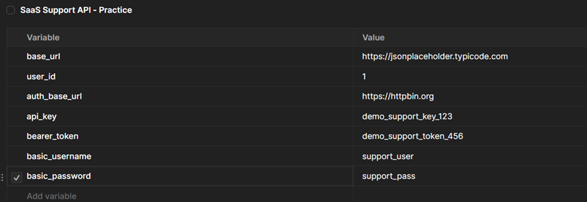
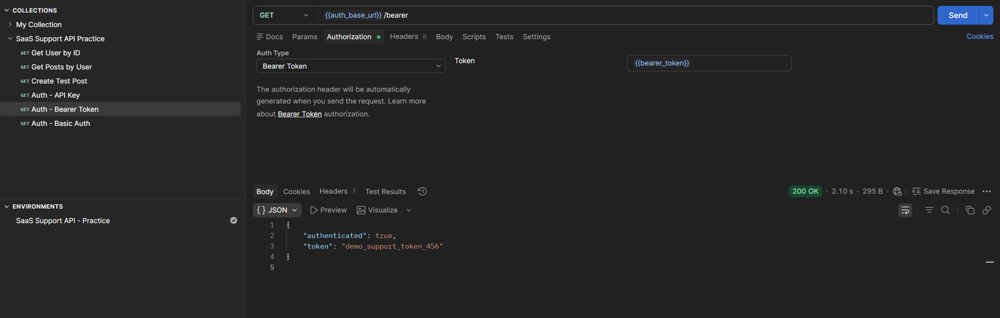

# D44 — API Authentication Basics in Postman

## Objective

The goal of this exercise was to understand and test three common API authentication methods in Postman:

- API Key
- Bearer Token
- Basic Auth

The exercise uses only public testing endpoints and fake credentials. No paid API or real secret is required.

## Repository location

```text
03_sql_api/
└── learning/
    └── api/
        ├── D43_postman_environment_variables.md
        ├── D44_api_auth_basics.md
        └── screenshots/
            ├── D44_01_auth_variables.png
            └── D44_02_auth_requests.png
```

## Tools

- Postman
- httpbin
- Postman environment variables
- Markdown
- GitHub

## Security rule

Only fake training credentials are used in this exercise.

Real API keys, passwords, bearer tokens and production secrets should never be committed to a public GitHub repository.

---

# Authentication vs authorization

Authentication answers:

```text
Who are you?
```

Authorization answers:

```text
What are you allowed to do?
```

An API may first authenticate the client and then decide whether that client is authorized to access a specific resource.

---

# Environment variables

The existing Postman environment from D43 was reused:

```text
SaaS Support API - Practice
```

The following training variables were added:

| Variable | Training value |
|---|---|
| `auth_base_url` | `https://httpbin.org` |
| `api_key` | `demo_support_key_123` |
| `bearer_token` | `demo_support_token_456` |
| `basic_username` | `support_user` |
| `basic_password` | `support_pass` |

These values are intentionally fake and safe to show in a public learning repository.



---

# 1. API Key

## Concept

An API key is a value issued to a client or application.

Depending on the API documentation, the key may be sent:

- in a request header,
- as a query parameter.

A common header pattern is:

```text
X-API-Key: <key>
```

For this training request, the API key is not used to unlock a real protected service. The public endpoint simply returns the request headers so that the authentication header can be inspected.

## Postman configuration

### Method

```text
GET
```

### URL

```text
{{auth_base_url}}/headers
```

### Authorization

```text
Type: API Key
```

Configure:

```text
Key: X-API-Key
Value: {{api_key}}
Add to: Header
```

### Expected result

The request should succeed and the response should show that an `X-API-Key` header was sent.

Example concept:

```json
{
  "headers": {
    "X-Api-Key": "demo_support_key_123"
  }
}
```

The exact capitalization of returned header names may differ.

---

# 2. Bearer Token

## Concept

Bearer authentication sends a token in the HTTP `Authorization` header.

The standard structure is:

```text
Authorization: Bearer <token>
```

The token is normally issued by an authentication system after a successful login or authorization flow.

## Postman configuration

### Method

```text
GET
```

### URL

```text
{{auth_base_url}}/bearer
```

### Authorization

```text
Type: Bearer Token
```

Token:

```text
{{bearer_token}}
```

Postman adds the required `Bearer` prefix automatically.

### Expected result

With the Bearer Token configured correctly, the endpoint should return a successful response.

## Negative test

The request was also tested with:

```text
No Auth
```

A protected Bearer endpoint should reject the request when the required authentication header is missing.

---

# 3. Basic Auth

## Concept

Basic authentication sends a username and password through the HTTP `Authorization` header.

The credentials are Base64 encoded, but Base64 is encoding, not encryption.

For this reason, Basic Auth should be used only over HTTPS.

## Postman configuration

### Method

```text
GET
```

### URL

```text
{{auth_base_url}}/basic-auth/{{basic_username}}/{{basic_password}}
```

### Authorization

```text
Type: Basic Auth
```

Username:

```text
{{basic_username}}
```

Password:

```text
{{basic_password}}
```

### Expected result

The endpoint compares the Basic Auth credentials with the username and password included in the URL.

When both values match, authentication succeeds.

## Negative test

Change the password temporarily to:

```text
wrong_password
```

and send the request again.

The authentication request should fail.

Restore:

```text
basic_password = support_pass
```

after the test.

---

# Authentication comparison

| Method | What is sent | Typical location | Typical use |
|---|---|---|---|
| API Key | Generated key | Header or query parameter | Application or client identification |
| Bearer Token | Access token | `Authorization` header | Modern authenticated APIs |
| Basic Auth | Username + password | `Authorization` header | Simple or legacy authentication |

---

# Postman requests created

The existing collection was reused:

```text
SaaS Support API Practice
```

Three requests were added:

```text
Auth - API Key
Auth - Bearer Token
Auth - Basic Auth
```



---

# Troubleshooting notes

## 401 Unauthorized

Typical causes:

- missing credentials,
- incorrect username or password,
- invalid or expired token,
- malformed Authorization header,
- wrong authentication type.

## 403 Forbidden

A `403` usually means that the request was understood, but the authenticated client does not have permission to perform the operation.

## API key is not visible

Check:

- whether `API Key` is selected in Authorization,
- whether `Add to` is set to `Header`,
- whether the variable has a value,
- whether the correct environment is active.

## Bearer request fails

Check that Postman is configured as:

```text
Type: Bearer Token
Token: {{bearer_token}}
```

Do not manually type `Bearer {{bearer_token}}` inside the Token field when using Postman's Bearer Token helper, because Postman adds the prefix.

---

# Business relevance

Authentication issues are common in Technical Support and SaaS Support.

A support engineer may need to determine whether an API failure is caused by:

- an invalid API key,
- a missing Authorization header,
- an expired token,
- incorrect credentials,
- insufficient permissions,
- incorrect environment configuration.

Understanding the authentication method makes it easier to distinguish application errors from authorization or configuration problems.

---

# Support troubleshooting example

A customer reports:

```text
Our integration stopped working and every API request returns 401.
```

A useful support investigation could include:

1. Identify the authentication method required by the endpoint.
2. Check whether the expected authentication header is present.
3. Confirm that the correct environment or account is being used.
4. Verify whether the key or token has expired or been revoked.
5. Confirm that the request uses the correct header format.
6. Reproduce the request in Postman.
7. Compare a successful and failed request.
8. Avoid asking the customer to expose a secret in screenshots or tickets.

---

# Key lessons

During this exercise, I learned how to:

- distinguish authentication from authorization,
- configure API Key authentication in Postman,
- configure Bearer Token authentication,
- configure Basic Auth,
- use environment variables for training credentials,
- understand how authentication data is added to HTTP requests,
- recognize common `401` authentication failures,
- understand the difference between `401` and `403`,
- perform simple positive and negative authentication tests,
- avoid exposing real API credentials in public documentation.

---

# Completion checklist

- [ ] Reused the existing `SaaS Support API Practice` collection.
- [ ] Reused the existing `SaaS Support API - Practice` environment.
- [ ] Added the five training authentication variables.
- [ ] Sent an API Key request.
- [ ] Verified the API key header.
- [ ] Sent a Bearer Token request.
- [ ] Tested the Bearer endpoint without authentication.
- [ ] Sent a Basic Auth request with correct credentials.
- [ ] Tested Basic Auth with an incorrect password.
- [ ] Restored the correct training password.
- [ ] Added two screenshots.
- [ ] Added this Markdown document to GitHub.

## Git commit

```text
Complete API authentication basics practice
```
