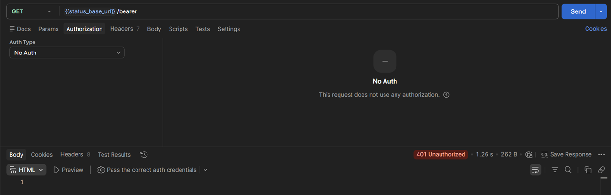
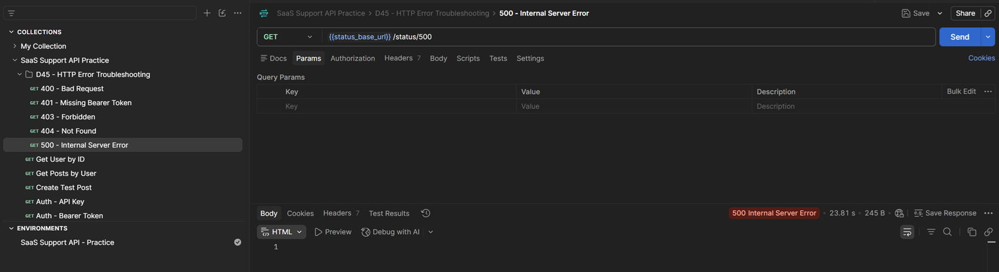

# D45 — API Troubleshooting Case Study: HTTP Error Statuses

## Objective

The goal of this exercise was to practise API troubleshooting from a SaaS Support perspective.

I reproduced five common HTTP error responses in Postman and documented:

- what the status code means,
- a realistic support scenario,
- likely causes,
- what should be checked first,
- the appropriate next troubleshooting step,
- when the issue should be escalated.

The case study covers:

- `400 Bad Request`
- `401 Unauthorized`
- `403 Forbidden`
- `404 Not Found`
- `500 Internal Server Error`

## Repository location

```text
03_sql_api/
└── learning/
    └── api/
        ├── D45_api_troubleshooting_statuses.md
        └── screenshots/
            ├── D45_01_401_auth_troubleshooting.png
            └── D45_02_status_error_requests.png
```

## Tools

- Postman
- httpbin
- HTTP status codes
- Postman environments
- Markdown
- GitHub

## Postman setup

I reused the existing collection:

```text
SaaS Support API Practice
```

I created a collection folder named:

```text
D45 - HTTP Error Troubleshooting
```

I also reused the existing Postman environment:

```text
SaaS Support API - Practice
```

and added:

```text
status_base_url = https://httpbin.org
```

The variable is referenced as:

```text
{{status_base_url}}
```

This keeps the requests reusable instead of hardcoding the API host in every request.

---

# Quick troubleshooting framework

When an API request fails, I use the following sequence:

```text
1. Check the HTTP status code
2. Check the request URL and HTTP method
3. Check path and query parameters
4. Check request headers
5. Check authentication
6. Check permissions
7. Check the request body and JSON syntax
8. Check the response body and response headers
9. Compare the request with API documentation
10. Retry only when the error type makes retrying appropriate
11. Escalate with request evidence when the problem appears server-side
```

The status code narrows the investigation, but it does not by itself prove the exact root cause.

---

# Case 1 — 400 Bad Request

## Test request

```text
GET {{status_base_url}}/status/400
```

## Expected response

```text
400 Bad Request
```

## Meaning

A `400 Bad Request` indicates that the server cannot or will not process the request because it considers something about the request to be a client error.

Typical causes include:

- malformed request syntax,
- invalid request format,
- malformed JSON,
- invalid parameters,
- missing required input,
- incorrect data type,
- invalid request framing.

## SaaS Support scenario

A customer reports that creating a user through the API fails with:

```text
400 Bad Request
```

Example request body:

```json
{
  "email": "customer@example.com",
  "active": "yes"
}
```

The API documentation expects:

```json
{
  "email": "customer@example.com",
  "active": true
}
```

The `active` field was sent as a string instead of a boolean.

## Troubleshooting checks

Check:

1. Is the endpoint correct?
2. Is the HTTP method correct?
3. Is the JSON valid?
4. Are all required fields present?
5. Are field names correct?
6. Are values using the expected data types?
7. Is the `Content-Type` header correct?
8. Does the response body contain a validation message?

## Next step

Compare the request body and parameters with the API documentation.

Correct invalid or missing request data and send the request again.

## Escalation decision

Usually do **not** escalate immediately.

A 400 response normally indicates that the request should first be corrected on the client side.

Escalate if:

- a request that exactly matches the documentation still fails,
- the API returns an incorrect validation error,
- the documented schema and actual API behavior do not match.

---

# Case 2 — 401 Unauthorized

## Test request

```text
GET {{status_base_url}}/bearer
```

Send the request with:

```text
Authorization: No Auth
```

## Expected response

```text
401 Unauthorized
```

## Meaning

A `401 Unauthorized` response means that valid authentication credentials are missing or were not accepted for the target resource.

Despite the status name, this is primarily an **authentication** problem.

## SaaS Support scenario

A customer reports:

```text
401 Unauthorized
```

when requesting:

```text
GET /api/v1/customers
```

Possible causes include:

- missing `Authorization` header,
- expired access token,
- invalid token,
- incorrect API key,
- malformed Bearer header,
- token created for a different environment,
- revoked credentials.

## Troubleshooting checks

Check:

1. Does the endpoint require authentication?
2. Is an `Authorization` header being sent?
3. Is the correct auth type selected?
4. Has the token expired?
5. Is the token copied correctly?
6. Is the request using the correct environment?
7. Does the token belong to the correct account or API?
8. Does the response include authentication-related headers or details?

## Practical Postman fix

In the request, open:

```text
Authorization
```

Choose:

```text
Bearer Token
```

and enter a temporary test token such as:

```text
support-training-token
```

Send the request again.

The httpbin Bearer endpoint accepts the Bearer authentication format and returns a successful response when the header is present.

## Next step

Obtain or regenerate valid credentials and resend the request.

Do not repeatedly retry the same request with the same invalid credentials.

## Escalation decision

Escalate if:

- known-valid credentials are consistently rejected,
- token generation fails,
- authentication services appear unavailable,
- multiple customers report the same authentication failure.



---

# Case 3 — 403 Forbidden

## Test request

```text
GET {{status_base_url}}/status/403
```

## Expected response

```text
403 Forbidden
```

## Meaning

A `403 Forbidden` response means that the server understood the request but refuses to fulfill it.

If authentication credentials were supplied, the credentials may be valid but insufficient for the requested action.

## SaaS Support scenario

An authenticated user can retrieve customer records but receives:

```text
403 Forbidden
```

when trying to delete one.

Possible causes include:

- insufficient role permissions,
- missing API scope,
- organization policy,
- resource ownership restrictions,
- IP allowlist restrictions,
- account-level feature restrictions,
- endpoint restricted to administrators.

## Troubleshooting checks

Check:

1. Is the user authenticated successfully?
2. What role does the user have?
3. Which permissions or scopes are required?
4. Is the resource owned by another user or organization?
5. Are there account or workspace restrictions?
6. Is the endpoint available on the customer's plan?
7. Are IP or security policies blocking the request?

## Next step

Verify permissions and required scopes.

If the user should have access, compare the account permissions with the API documentation and administrative configuration.

## 401 vs 403

A useful troubleshooting distinction:

```text
401 → Who are you? Valid authentication is missing or rejected.

403 → I know who you are, but this action is not allowed.
```

This is a troubleshooting shortcut rather than a replacement for checking the API's documentation and response details.

## Escalation decision

Escalate if:

- the user clearly has the required permission,
- the required scope is present,
- the resource should be accessible,
- the authorization result does not match account configuration.

---

# Case 4 — 404 Not Found

## Test request

```text
GET {{status_base_url}}/status/404
```

## Expected response

```text
404 Not Found
```

## Meaning

A `404 Not Found` response means that the server did not find a current representation for the target resource or is not willing to disclose that the resource exists.

## SaaS Support scenario

A customer sends:

```text
GET /api/v1/users/987654
```

and receives:

```text
404 Not Found
```

Possible causes include:

- incorrect endpoint path,
- incorrect resource ID,
- deleted resource,
- wrong API version,
- wrong environment,
- incorrect base URL,
- route no longer exists,
- the API intentionally hides a forbidden resource behind a 404 response.

## Troubleshooting checks

Check:

1. Is the URL spelled correctly?
2. Is the API version correct?
3. Does the resource ID exist?
4. Is the request being sent to production or staging?
5. Does the same resource appear in the application UI?
6. Was the resource deleted?
7. Has the endpoint changed?
8. Does the documentation show a different path?

## Next step

Verify the endpoint and resource identifier.

If possible, first list available resources and confirm that the target ID exists.

Example troubleshooting approach:

```text
GET /users
```

then:

```text
GET /users/{confirmed_id}
```

## Escalation decision

Escalate if:

- the resource definitely exists,
- the correct environment and endpoint are being used,
- the customer has access,
- other requests can retrieve the same resource but this endpoint cannot.

---

# Case 5 — 500 Internal Server Error

## Test request

```text
GET {{status_base_url}}/status/500
```

## Expected response

```text
500 Internal Server Error
```

## Meaning

A `500 Internal Server Error` means that the server encountered an unexpected condition that prevented it from fulfilling the request.

This is a server-side error class.

## SaaS Support scenario

A customer's valid request suddenly returns:

```text
500 Internal Server Error
```

Possible causes include:

- application exception,
- database failure,
- backend dependency failure,
- unexpected server-side data condition,
- deployment regression,
- unhandled edge case,
- temporary infrastructure issue.

## Troubleshooting checks

Before escalating, verify:

1. Is the request otherwise valid?
2. Can the issue be reproduced?
3. Does it affect one request or multiple requests?
4. Does it affect one customer or many?
5. Did the same request previously work?
6. Is there a request ID or correlation ID?
7. Is there a timestamp?
8. Is a service-status incident already known?
9. Does retrying once after a short interval change the result?

## Next step

Capture enough evidence for technical escalation:

```text
timestamp
endpoint
HTTP method
status code
request ID / correlation ID
customer or account ID
sanitized request body
sanitized response body
reproduction steps
frequency
business impact
```

Do not include:

- passwords,
- API secrets,
- full access tokens,
- unnecessary personal data.

## Escalation decision

A reproducible `500` with a valid request is normally appropriate for escalation to the technical or engineering team.

The support agent should provide complete reproduction information instead of only reporting:

```text
"The API does not work."
```

---

# Status comparison

| Status | Category | Typical cause | First support action |
|---|---|---|---|
| `400` | Client request | Invalid request data or syntax | Validate request structure |
| `401` | Authentication | Missing or invalid credentials | Check authentication |
| `403` | Authorization | Valid identity but insufficient permission | Check roles and scopes |
| `404` | Resource / route | Wrong path or missing resource | Verify URL and resource ID |
| `500` | Server | Unexpected backend failure | Reproduce and collect escalation evidence |

---

# Support decision tree

```text
API request failed
        ↓
Check HTTP status
        ↓
400 → validate request body / params / syntax
401 → validate authentication / token / API key
403 → validate authorization / role / scope
404 → validate path / resource ID / environment
500 → reproduce / collect evidence / escalate if request is valid
```



---

# Example support notes

## 400 example

```text
Customer receives 400 when creating a user.

Checked request body against API documentation.
The "active" field was sent as a string instead of a boolean.

Next step:
Customer should resend the request with the documented field type.
```

## 401 example

```text
Customer receives 401 on an authenticated endpoint.

Authorization header is missing from the request.

Next step:
Add a valid Bearer token and retry.
```

## 403 example

```text
Customer is authenticated but receives 403 when deleting a resource.

Account has read access but does not have the required delete permission.

Next step:
Verify the user's role and required API scope.
```

## 404 example

```text
Customer receives 404 for a specific user ID.

Base URL and endpoint are correct, but the supplied resource ID does not exist.

Next step:
Confirm the resource ID using the list endpoint.
```

## 500 example

```text
Customer receives reproducible 500 responses for a valid request.

Request syntax and authentication have been verified.

Next step:
Collect timestamp, endpoint, sanitized payload, response, request ID and reproduction steps, then escalate to the technical team.
```

---

# Key lessons

During this exercise, I learned that HTTP status codes are not only error messages.

They help determine the next troubleshooting branch.

A support engineer should avoid immediately escalating every API failure.

Instead:

```text
400 → inspect the request
401 → inspect authentication
403 → inspect permissions
404 → inspect resource and route
500 → validate request, reproduce and prepare escalation
```

I also learned to distinguish authentication from authorization:

```text
Authentication = verifying identity
Authorization  = verifying permission
```

---

# Skills demonstrated

- REST API troubleshooting
- Postman
- HTTP status-code interpretation
- request validation
- authentication troubleshooting
- authorization troubleshooting
- API endpoint troubleshooting
- technical escalation
- reproduction steps
- support case documentation
- sensitive-data awareness
- SaaS Technical Support

---

# Completion checklist

- [ ] Reused the existing `SaaS Support API Practice` collection.
- [ ] Created the `D45 - HTTP Error Troubleshooting` folder.
- [ ] Reused the existing Postman environment.
- [ ] Added `status_base_url`.
- [ ] Reproduced `400 Bad Request`.
- [ ] Reproduced and troubleshot `401 Unauthorized`.
- [ ] Reproduced `403 Forbidden`.
- [ ] Reproduced `404 Not Found`.
- [ ] Reproduced `500 Internal Server Error`.
- [ ] Documented likely causes for each status.
- [ ] Documented the next support action for each status.
- [ ] Created two screenshots.
- [ ] Added this Markdown file to GitHub.

## Git commit

```text
Complete API status troubleshooting case study
```
