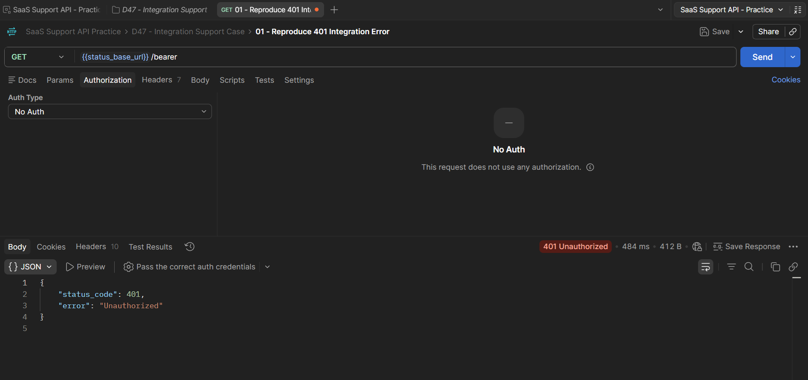
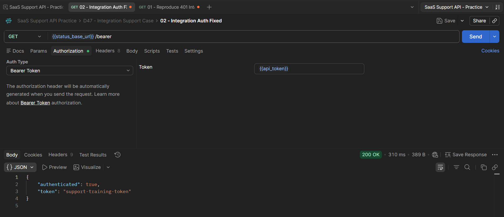

# D47 — API Integration Support Case

## Objective

The goal of this exercise was to simulate a realistic SaaS Technical Support case involving an API integration failure.

The customer reports that an integration stopped working and API requests return:

```text
401 Unauthorized
```

The exercise covers the complete support workflow:

- understand the customer report,
- reproduce the issue in Postman,
- inspect the request,
- verify environment variables,
- verify authentication,
- identify the root cause,
- confirm the fix,
- prepare a customer response,
- document a reusable troubleshooting checklist.

---

# Scenario

A customer reports:

```text
Our CRM integration stopped syncing data this morning.

The integration was working yesterday, but now every API request fails.

We receive:
401 Unauthorized

We have not changed the endpoint.
Can you help us identify the problem?
```

## Initial support assessment

The most important clue is:

```text
401 Unauthorized
```

This suggests that valid authentication credentials are missing or are not being accepted.

Possible causes include:

- missing Authorization header,
- invalid Bearer token,
- expired token,
- revoked credentials,
- wrong environment,
- wrong API key,
- malformed authorization format.

The issue should be reproduced before escalation.

---

# Postman setup

Reuse the existing collection:

```text
SaaS Support API Practice
```

Create a folder:

```text
D47 - Integration Support Case
```

Reuse the environment:

```text
SaaS Support API - Practice
```

The environment already contains:

```text
status_base_url = https://httpbin.org
```

Add:

```text
api_token = support-training-token
```

Reference it as:

```text
{{api_token}}
```

In a real environment, secrets must not be committed to GitHub.

---

# Request 1 — Reproduce the customer issue

## Request name

```text
01 - Reproduce 401 Integration Error
```

## Method

```text
GET
```

## URL

```text
{{status_base_url}}/bearer
```

## Authorization

```text
No Auth
```

## Expected result

```text
401 Unauthorized
```

This reproduces the customer's reported symptom.



---

# Troubleshooting investigation

## Step 1 — Confirm the final URL

The request uses:

```text
{{status_base_url}}/bearer
```

The environment resolves:

```text
{{status_base_url}}
```

to:

```text
https://httpbin.org
```

Final endpoint:

```text
https://httpbin.org/bearer
```

## Step 2 — Check the HTTP method

The request uses:

```text
GET
```

No method mismatch was found.

## Step 3 — Check authentication

The Authorization tab shows:

```text
No Auth
```

This is the main problem.

The endpoint requires Bearer authentication, but the request does not contain a valid Authorization header.

---

# Root cause

The integration request is missing valid Bearer authentication.

Root cause:

```text
Missing Authorization: Bearer <token> header
```

---

# Request 2 — Apply the fix

## Request name

```text
02 - Integration Auth Fixed
```

## Method

```text
GET
```

## URL

```text
{{status_base_url}}/bearer
```

## Authorization

Authorization type:

```text
Bearer Token
```

Token:

```text
{{api_token}}
```

Conceptually, Postman sends:

```text
Authorization: Bearer <token>
```

## Expected result

```text
200 OK
```

The successful response confirms that authentication configuration caused the failure.



---

# Before and after

## Failing request

```text
GET {{status_base_url}}/bearer
Authorization: No Auth
Result: 401 Unauthorized
```

## Fixed request

```text
GET {{status_base_url}}/bearer
Authorization: Bearer Token
Token: {{api_token}}
Result: 200 OK
```

---

# Customer response

```text
Hi,

Thanks for reporting this.

I reproduced the authentication failure and confirmed that the API endpoint itself is reachable.

The 401 response indicates that the request is reaching the API without valid authentication credentials. Please check that your integration is still sending the expected Bearer token in the Authorization header.

I recommend verifying:

1. that the token is still active and has not expired or been revoked,
2. that the integration is using the correct environment and API credentials,
3. that the Authorization header is being sent in the expected Bearer format,
4. whether the credentials were recently rotated or replaced.

After valid Bearer authentication was added to the test request, the API returned a successful response.

Please do not send passwords, API secrets or full access tokens by email. If the issue continues after the credentials are verified, please share the request timestamp, endpoint, HTTP method, response status and any request/correlation ID available.

Best,
Adrian
```

---

# API integration troubleshooting checklist

## 1. Understand the reported symptom

- [ ] What action is the integration trying to perform?
- [ ] What endpoint is failing?
- [ ] What HTTP method is being used?
- [ ] What HTTP status code is returned?
- [ ] When did the issue start?
- [ ] Did the integration work previously?
- [ ] Were credentials, configuration or API versions changed recently?

## 2. Reproduce the problem

- [ ] Recreate the request in Postman.
- [ ] Use the same HTTP method.
- [ ] Use the same endpoint structure.
- [ ] Use a safe test account or training environment when possible.
- [ ] Confirm whether the same status code can be reproduced.

## 3. Check URL and environment

- [ ] Confirm the active Postman environment.
- [ ] Verify the base URL variable.
- [ ] Check whether the customer is using production or staging.
- [ ] Confirm the API version.
- [ ] Confirm path parameters.
- [ ] Confirm query parameters.
- [ ] Check the final resolved URL.

## 4. Check authentication

- [ ] Does the endpoint require authentication?
- [ ] Is the correct authentication type selected?
- [ ] Is the Authorization header present?
- [ ] Is the token or API key valid?
- [ ] Has the token expired?
- [ ] Was the credential revoked?
- [ ] Was the credential recently rotated?
- [ ] Does the credential belong to the correct environment?
- [ ] Is the Bearer/API-key format correct?

## 5. Check authorization

- [ ] Is authentication successful but the request still returns 403?
- [ ] Does the account have the required role?
- [ ] Does the token contain the required scope?
- [ ] Is the endpoint restricted to specific users or plans?
- [ ] Are workspace, organization or resource permissions correct?

## 6. Check request data

- [ ] Is the JSON syntactically valid?
- [ ] Are required fields present?
- [ ] Are field names correct?
- [ ] Are data types correct?
- [ ] Is `Content-Type` correct?
- [ ] Are arrays and nested objects structured as documented?

## 7. Inspect the response

- [ ] Check the HTTP status code.
- [ ] Read the response body.
- [ ] Check response headers.
- [ ] Look for validation messages.
- [ ] Look for request or correlation IDs.
- [ ] Compare the response with API documentation.

## 8. Use Postman troubleshooting tools

- [ ] Open the Postman Console when the request behaves unexpectedly.
- [ ] Confirm the actual URL sent.
- [ ] Check the headers sent with the request.
- [ ] Check resolved variable values.
- [ ] Compare the request with a previously successful request when available.

## 9. Confirm the fix

- [ ] Change only the suspected configuration first.
- [ ] Send the request again.
- [ ] Confirm the expected successful status.
- [ ] Confirm that the expected response data is returned.
- [ ] Document what changed.

## 10. Escalate with useful evidence

Collect:

```text
timestamp
environment
endpoint
HTTP method
HTTP status
customer/account ID
request/correlation ID
sanitized request headers
sanitized request body
sanitized response
steps to reproduce
expected result
actual result
business impact
```

Never include:

```text
passwords
API secrets
full access tokens
unnecessary personal data
```

---

# Support reasoning

```text
Customer reports integration failure
        ↓
Identify HTTP 401
        ↓
Reproduce request in Postman
        ↓
Verify URL and method
        ↓
Inspect Authorization
        ↓
No valid Bearer authentication
        ↓
Add Bearer token
        ↓
Request returns 200
        ↓
Root cause confirmed
        ↓
Prepare customer response
```

---

# Connection to previous exercises

## D43 — Postman variables

Used:

```text
{{status_base_url}}
{{api_token}}
```

## D45 — HTTP troubleshooting

Used `401 Unauthorized` to choose the authentication troubleshooting branch.

## D46 — JSON basics

The same troubleshooting process can be used to validate request bodies, field names and data types when integration failures involve JSON payloads.

---

# Skills demonstrated

- SaaS Technical Support
- REST API troubleshooting
- Postman
- API authentication
- Bearer Token authentication
- Postman environments
- Postman variables
- HTTP status-code analysis
- issue reproduction
- root-cause isolation
- customer communication
- troubleshooting documentation
- technical escalation
- security awareness

---

# Completion checklist

- [ ] Reused the `SaaS Support API Practice` collection.
- [ ] Created `D47 - Integration Support Case`.
- [ ] Reused the existing Postman environment.
- [ ] Added `api_token` as an environment variable.
- [ ] Reproduced a `401 Unauthorized` integration failure.
- [ ] Verified the endpoint and HTTP method.
- [ ] Identified missing Bearer authentication.
- [ ] Added Bearer authentication using `{{api_token}}`.
- [ ] Confirmed a successful response.
- [ ] Created the customer response.
- [ ] Created the troubleshooting checklist.
- [ ] Added two screenshots.
- [ ] Added this Markdown document to GitHub.

## Git commit

```text
Complete API integration support case
```
