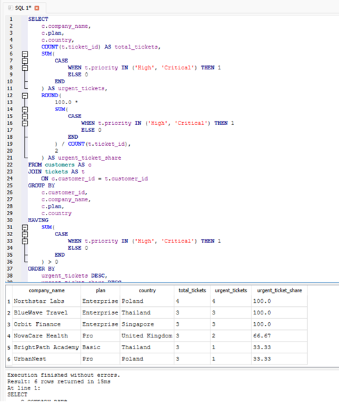

# D42 — SQL Case Interview: Support Business Questions

## Objective

The goal of this exercise was to answer practical business questions using SQL and explain the results from the perspective of a SaaS Support team.

Instead of creating a new dataset, I reused the SQLite database created during the D41 SQL Support Reporting project.

## Repository location

```text
03_sql_api/
└── learning/
    └── sql/
        ├── D42_sql_case_interview.md
        └── screenshots/
            └── D42_01_case_interview_results.png
```

## Source database

```text
05_projects/03_sql_support_reporting/D41_support.db
```

The database contains:

- 8 customers,
- 24 support tickets,
- customer plan and country information,
- ticket categories and priorities,
- first response times,
- resolution times,
- ticket ownership and status data.

## Case interview method

For each question, I followed the same process:

1. Identified the required tables and columns.
2. Defined the aggregation level.
3. Selected the appropriate SQL functions.
4. Executed the query.
5. Verified the result.
6. Translated the result into a short business conclusion.

---

## Business question 1 — Which country generates the most support tickets?

### SQL query

```sql
SELECT
    c.country,
    COUNT(t.ticket_id) AS ticket_count,
    COUNT(DISTINCT c.customer_id) AS customer_count,
    ROUND(
        1.0 * COUNT(t.ticket_id) /
        COUNT(DISTINCT c.customer_id),
        2
    ) AS tickets_per_customer
FROM customers AS c
JOIN tickets AS t
    ON c.customer_id = t.customer_id
GROUP BY c.country
ORDER BY ticket_count DESC, c.country ASC;
```

### Result

| Country | Ticket count | Customer count | Tickets per customer |
|---|---:|---:|---:|
| Poland | 9 | 3 | 3.00 |
| Thailand | 6 | 2 | 3.00 |
| Germany | 3 | 1 | 3.00 |
| Singapore | 3 | 1 | 3.00 |
| United Kingdom | 3 | 1 | 3.00 |

### Business conclusion

Poland generated the largest total number of support tickets, with 9 tickets from 3 customers.

However, every country generated an average of 3 tickets per customer. The higher Polish ticket volume was therefore caused by the larger number of Polish customers in the dataset, rather than unusually high ticket activity per customer.

---

## Business question 2 — What is the average ticket resolution time?

### Overall average resolution time

```sql
SELECT
    COUNT(*) AS resolved_ticket_count,
    ROUND(AVG(resolution_hours), 2) AS avg_resolution_hours
FROM tickets
WHERE resolution_hours IS NOT NULL;
```

### Result

| Resolved tickets | Average resolution time |
|---:|---:|
| 17 | 10.85 hours |

### Resolution time by priority

```sql
SELECT
    priority,
    COUNT(*) AS resolved_ticket_count,
    ROUND(AVG(resolution_hours), 2) AS avg_resolution_hours
FROM tickets
WHERE resolution_hours IS NOT NULL
GROUP BY priority
ORDER BY avg_resolution_hours DESC;
```

### Result

| Priority | Resolved tickets | Average resolution time |
|---|---:|---:|
| Medium | 4 | 15.25 hours |
| High | 6 | 13.83 hours |
| Low | 4 | 7.75 hours |
| Critical | 3 | 3.17 hours |

### Business conclusion

The overall average resolution time was 10.85 hours across 17 resolved or closed tickets.

Critical tickets had the shortest average resolution time at 3.17 hours, suggesting that urgent incidents were escalated and handled quickly. Medium-priority tickets had the longest average resolution time at 15.25 hours.

The result should be treated as an operational indicator rather than a final performance assessment because the dataset is small and ticket complexity may differ between priority groups.

---

## Business question 3 — Which customer has the most urgent tickets?

For this analysis, `High` and `Critical` tickets were treated as urgent.

### SQL query

```sql
SELECT
    c.company_name,
    c.plan,
    c.country,
    COUNT(t.ticket_id) AS total_tickets,
    SUM(
        CASE
            WHEN t.priority IN ('High', 'Critical') THEN 1
            ELSE 0
        END
    ) AS urgent_tickets,
    ROUND(
        100.0 *
        SUM(
            CASE
                WHEN t.priority IN ('High', 'Critical') THEN 1
                ELSE 0
            END
        ) / COUNT(t.ticket_id),
        2
    ) AS urgent_ticket_share
FROM customers AS c
JOIN tickets AS t
    ON c.customer_id = t.customer_id
GROUP BY
    c.customer_id,
    c.company_name,
    c.plan,
    c.country
HAVING
    SUM(
        CASE
            WHEN t.priority IN ('High', 'Critical') THEN 1
            ELSE 0
        END
    ) > 0
ORDER BY
    urgent_tickets DESC,
    urgent_ticket_share DESC,
    c.company_name ASC;
```

### Result

| Customer | Plan | Country | Total tickets | Urgent tickets | Urgent share |
|---|---|---|---:|---:|---:|
| Northstar Labs | Enterprise | Poland | 4 | 4 | 100% |
| BlueWave Travel | Enterprise | Thailand | 3 | 3 | 100% |
| Orbit Finance | Enterprise | Singapore | 3 | 3 | 100% |
| NovaCare Health | Pro | United Kingdom | 3 | 2 | 66.67% |
| BrightPath Academy | Basic | Thailand | 3 | 1 | 33.33% |
| UrbanNest | Pro | Poland | 3 | 1 | 33.33% |

### Business conclusion

Northstar Labs had the largest number of urgent support tickets, with 4 urgent tickets.

BlueWave Travel and Orbit Finance followed with 3 urgent tickets each. All tickets submitted by these three customers were classified as either High or Critical.

The support team should review whether these customers:

- use more complex product features,
- require additional onboarding,
- experience recurring configuration issues,
- need proactive technical guidance,
- should receive a dedicated follow-up.



---

## Interview summary

### Where is the highest ticket volume?

Poland generated the highest ticket volume, with 9 tickets. The result was driven by the number of customers rather than a higher average number of tickets per customer.

### What is the average resolution time?

The overall average resolution time was 10.85 hours. Critical tickets were resolved fastest, while Medium-priority tickets had the highest average resolution time.

### Which customer has the most urgent tickets?

Northstar Labs had the highest number of urgent tickets, with 4 High or Critical cases.

## SQL techniques demonstrated

- `SELECT`
- `WHERE`
- `INNER JOIN`
- `GROUP BY`
- `HAVING`
- `ORDER BY`
- `COUNT`
- `COUNT(DISTINCT)`
- `AVG`
- `ROUND`
- conditional aggregation with `SUM` and `CASE`
- percentage calculation
- translating query results into business conclusions

## Key interview lessons

A good SQL interview answer should include more than a working query.

The final response should explain:

- what was measured,
- how the metric was calculated,
- what the result means,
- whether the result may be affected by dataset size or structure,
- what action the business could take next.

## Completion checklist

- [ ] Reused the existing D41 SQLite database.
- [ ] Answered three support business questions.
- [ ] Used joins and aggregate functions.
- [ ] Used conditional aggregation for urgent tickets.
- [ ] Compared total volume with volume per customer.
- [ ] Added business conclusions.
- [ ] Documented the case interview in Markdown.
- [ ] Added the final screenshot.
- [ ] Committed the exercise to GitHub.

## Git commit

```bash
git add 03_sql_api/learning/sql/
git commit -m "Complete D42 SQL support case interview"
git push
```
