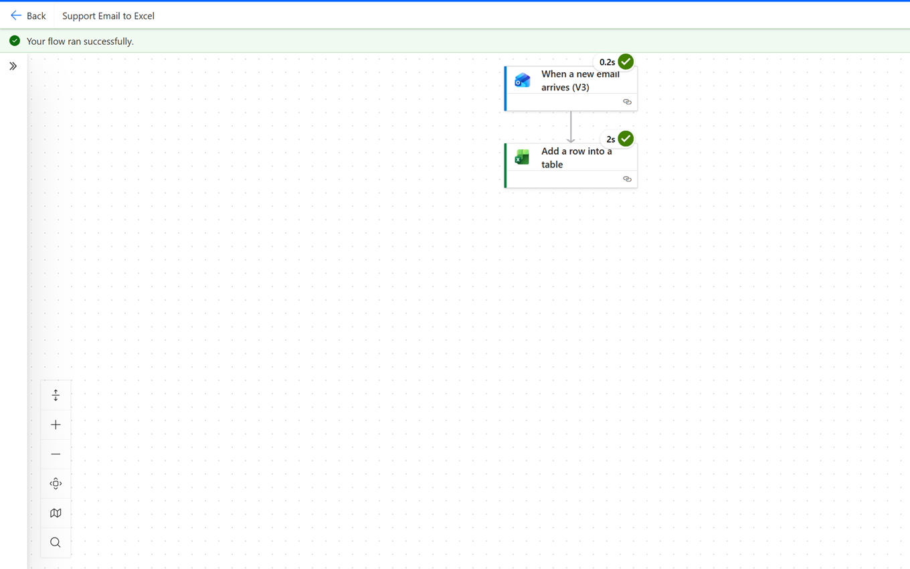
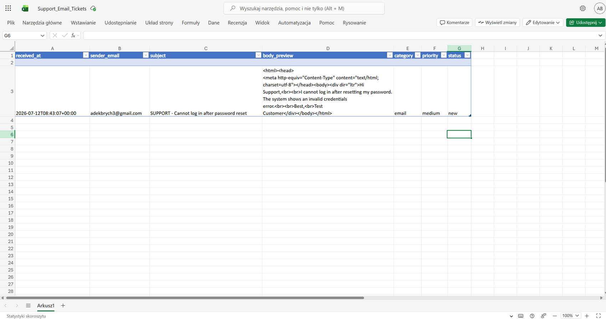

# Project 2 — Power Automate Support Ticket Automation

## Project overview

This project is a practical Microsoft Power Automate support-ticket automation system developed through multiple incremental exercises.

The project demonstrates several ways of creating and processing support tickets:

- scheduled automation,
- manually triggered flows,
- email-triggered ticket intake,
- Excel-based ticket storage,
- OneDrive attachment handling,
- conditional routing,
- approval workflows,
- ticket updates,
- retry policies,
- structured error handling.

The goal was to build practical automation skills relevant to SaaS Support, Technical Support and support operations.

---

# Business problem

Support teams often receive requests through multiple channels and need to manually:

- create ticket records,
- copy information from emails,
- save attachments,
- classify requests,
- identify urgent issues,
- request approvals,
- update ticket statuses,
- notify users,
- troubleshoot failed automations.

This creates repetitive work and increases the risk of:

- missing requests,
- incomplete ticket data,
- inconsistent routing,
- forgotten attachments,
- delayed approvals,
- failed workflow runs,
- outdated ticket statuses.

The project explores how Power Automate can reduce this manual work while keeping support agents responsible for important decisions.

---

# Project architecture

The project contains three main automation areas.

```text
Support Ticket Automation
│
├── Recurring flow
│   ├── Scheduled trigger
│   ├── Read support data
│   └── Send status notification
│
├── Instant flow
│   ├── Manual trigger
│   ├── Accept ticket information
│   ├── Create Excel ticket
│   └── Send confirmation
│
└── Email intake flow
    ├── Outlook trigger
    ├── Read incoming email
    ├── Parse ticket information
    ├── Process attachments
    ├── Save files to OneDrive
    └── Create support ticket
```

The workflows were later extended with:

```text
Conditions
→ Switch routing
→ Approval workflows
→ Update a row
→ Retry policies
→ Configure run after
→ TRY/CATCH-style error handling
```

---

# Project components

## 1. Recurring and instant flows

This module demonstrates two different Power Automate trigger models.

### Scheduled flow

The scheduled flow demonstrates:

- scheduled cloud flows,
- recurrence triggers,
- automated execution,
- support-ticket table checks,
- email notifications,
- run history.

### Instant flow

The instant flow demonstrates:

- manually triggered cloud flows,
- trigger inputs,
- dynamic content,
- Excel ticket creation,
- confirmation emails,
- successful and failed run analysis.

[View Recurring and Instant Flow](recurring_and_instant_flow/)

---

## 2. Email ticket intake

This module automatically converts incoming Outlook messages into support-ticket records.

The flow demonstrates:

- Office 365 Outlook triggers,
- subject-line processing,
- dynamic email content,
- attachment detection,
- `Apply to each`,
- attachment downloading,
- OneDrive file creation,
- automatic Excel ticket creation,
- workflow testing,
- run-history analysis.

[View Email Ticket Intake](email_ticket_intake/)

---

## 3. Email-to-Excel support workflow

An earlier workflow demonstrates the core support automation pattern:

```text
Incoming support email
        ↓
Power Automate trigger
        ↓
Extract email information
        ↓
Create structured Excel record
        ↓
Support agent can continue processing the ticket
```

Detailed documentation:

[View Support Email to Sheet Flow](support_email_to_sheet_flow.md)

### Flow overview



### Flow result



---

# Power Automate skills developed

## Excel table operations

The project includes practical work with Excel Online tables.

Exercises covered:

- structured Excel tables,
- adding rows,
- retrieving ticket information,
- updating existing rows,
- mapping Power Automate dynamic content to Excel columns.

Related learning log:

[View D33 — Excel Tables](../../02_power_automate/learning/D33_excel_tables/)

---

## Conditions and routing

Conditional logic was used to control workflow behavior based on ticket data.

The exercises include:

- `Condition`,
- priority-based routing,
- escalation logic,
- true/false branches,
- `Switch` actions,
- multiple processing paths.

Related learning log:

[View D34 — Conditions](../../02_power_automate/learning/D34_conditions/)

---

## Approval workflows

Approval actions were used for support scenarios requiring human authorization.

The exercises include:

- creating approval requests,
- waiting for approval results,
- checking approval outcomes,
- routing approved and rejected cases,
- using approval decisions before continuing automation.

This is useful for scenarios such as:

- refund requests,
- account access changes,
- sensitive customer actions,
- exception handling.

Related learning log:

[View D35 — Approvals](../../02_power_automate/learning/D35_approvals/)

---

## Error handling and reliability

The workflow exercises were expanded beyond basic happy-path automation.

The project includes experience with:

- Power Automate run history,
- failed action analysis,
- retry policies,
- Configure run after,
- controlled failure paths,
- TRY/CATCH-style workflow design,
- fallback logic.

Related learning log:

[View D36 — Error Handling](../../02_power_automate/learning/D36_error_handling/)

---

## Workflow documentation

The final learning stage focused on documenting automation in a way that another support or technical team member could understand.

The documentation covers:

- workflow purpose,
- trigger behavior,
- ownership,
- dependencies,
- risks,
- failure scenarios,
- troubleshooting,
- support use cases.

Related learning log:

[View D37 — Documentation](../../02_power_automate/learning/D37_documentation/)

---

# Example support workflow

A more advanced support workflow can follow this pattern:

```text
Incoming customer request
        ↓
Create ticket
        ↓
Check priority
        ↓
Condition / Switch
        ↓
┌─────────────────────────────┐
│ Standard request            │
│ → continue normal handling  │
└─────────────────────────────┘

or

┌─────────────────────────────┐
│ Sensitive request           │
│ → request approval          │
└─────────────────────────────┘
        ↓
Check approval result
        ↓
Update ticket row
        ↓
Send notification
        ↓
Handle success or failure
```

This architecture separates routine processing from cases that require additional human control.

---

# Error-handling approach

Automation cannot assume that every connector or action will always succeed.

Potential failures include:

- Outlook connector errors,
- missing email data,
- Excel file access problems,
- OneDrive failures,
- invalid attachment data,
- approval timeout,
- missing Excel rows,
- temporary connector errors.

The workflows therefore explore several reliability mechanisms.

## Retry policies

Temporary connector failures can be retried automatically.

## Configure run after

Actions can be configured to execute after:

- success,
- failure,
- timeout,
- skipped actions.

This allows the workflow to follow controlled error paths.

## TRY/CATCH-style structure

Power Automate does not use traditional programming `try/catch` syntax, but similar behavior can be designed using scopes and `Configure run after`.

Conceptually:

```text
TRY
├── process ticket
├── update data
└── send notification

CATCH
├── capture failure
├── record error information
└── trigger fallback procedure
```

---

# Human-in-the-loop controls

Automation is useful for repetitive support operations, but some actions should remain under human control.

Human review is especially important for:

- refunds,
- account access,
- billing changes,
- sensitive customer requests,
- unclear ticket information,
- high-impact actions.

Approval workflows allow automation to prepare and route work without automatically performing sensitive actions.

---

# Project evidence

## Email-to-Excel flow


This flow demonstrates the basic email-to-ticket automation pattern.

---

## Email-to-Excel result


The result demonstrates successful creation of structured ticket information.

---

## Email Ticket Intake

The Email Ticket Intake module contains additional screenshots covering:

- Outlook trigger configuration,
- flow architecture,
- attachment processing,
- OneDrive file creation,
- Excel ticket creation,
- successful run history.

[View Email Ticket Intake evidence](email_ticket_intake/)

---

## Recurring and Instant Flow

The Recurring and Instant Flow module contains screenshots covering:

- scheduled flow configuration,
- scheduled execution,
- manual trigger inputs,
- ticket creation,
- successful run history,
- failed run analysis.

[View Recurring and Instant Flow evidence](recurring_and_instant_flow/)

---

# Tools and technologies

```text
Microsoft Power Automate
Office 365 Outlook
Excel Online
OneDrive for Business
Cloud Flows
Scheduled Triggers
Manual Triggers
Email Triggers
Conditions
Switch
Approvals
Update a row
Apply to each
Dynamic Content
Power Automate Expressions
Retry Policies
Configure run after
Scopes
Run History
Markdown
Git
GitHub
```

---

# Skills demonstrated

- workflow automation,
- SaaS Support automation,
- support ticket processing,
- Outlook integration,
- Excel Online integration,
- OneDrive integration,
- email automation,
- attachment processing,
- conditional routing,
- approval workflows,
- Excel row updates,
- scheduled automation,
- instant cloud flows,
- error handling,
- retry configuration,
- workflow troubleshooting,
- run-history analysis,
- technical documentation,
- human-in-the-loop workflow design.

---

# Business value

A support-ticket automation system like this could reduce repetitive administrative work.

Potential benefits include:

- faster ticket registration,
- fewer manually copied fields,
- consistent ticket structures,
- automatic attachment storage,
- faster routing of urgent requests,
- controlled approval processes,
- improved ticket status tracking,
- better workflow visibility,
- easier troubleshooting,
- reduced risk of forgotten support requests.

The project also demonstrates how relatively simple Microsoft 365 tools can be combined to create support workflows without requiring a dedicated ticketing platform for every prototype or internal process.

---

# Risks and controls

## Incorrect routing

A ticket may be assigned to the wrong workflow branch.

**Control:**  
Use explicit conditions and clearly defined priority or category values.

---

## Duplicate processing

The same email or ticket could potentially be processed more than once.

**Control:**  
Use unique ticket identifiers and verify existing records before creating duplicates.

---

## Attachment failure

An email attachment may fail to save to OneDrive.

**Control:**  
Use run-history monitoring and controlled failure paths.

---

## Excel connector failure

Excel may be temporarily unavailable or a row may not be found.

**Control:**  
Use retry policies, error handling and fallback procedures.

---

## Approval delays

A workflow may remain waiting for a human decision.

**Control:**  
Define ownership and escalation procedures for approval requests.

---

## Automation dependency

A support process should not become impossible to execute manually if the automation fails.

**Control:**  
Maintain a documented manual fallback process.

---

# What I learned

During this project, I learned how to:

- create scheduled Power Automate flows,
- create manually triggered flows,
- use Outlook email triggers,
- extract dynamic email content,
- parse text values,
- process attachments,
- save files to OneDrive,
- create and update Excel ticket records,
- build conditional workflow branches,
- use Switch actions,
- create approval workflows,
- evaluate approval results,
- configure retry behavior,
- use Configure run after,
- design TRY/CATCH-style error handling,
- troubleshoot failed flow runs,
- use run history to identify problems,
- document an automation project for a technical portfolio.

The most important lesson was that a reliable automation is not only a workflow that succeeds when everything works correctly. It also needs predictable behavior when an action fails.

---

# Project structure

```text
02_support_ticket_automation/
├── README.md
│
├── support_email_to_sheet_flow.md
│
├── screenshots/
│   ├── support_email_to_sheet_flow.png
│   └── support_email_to_sheet_result.png
│
├── email_ticket_intake/
│   ├── README.md
│   └── screenshots/
│
└── recurring_and_instant_flow/
    ├── README.md
    └── screenshots/
```

---

# Project resources

| Resource | Description |
|---|---|
| [Support Email to Sheet Flow](support_email_to_sheet_flow.md) | Core email-to-Excel support automation |
| [Email Ticket Intake](email_ticket_intake/) | Email-triggered ticket creation and attachment handling |
| [Recurring and Instant Flow](recurring_and_instant_flow/) | Scheduled and manually triggered support automation |
| [D33 — Excel Tables](../../02_power_automate/learning/D33_excel_tables/) | Excel table operations |
| [D34 — Conditions](../../02_power_automate/learning/D34_conditions/) | Conditional routing and Switch |
| [D35 — Approvals](../../02_power_automate/learning/D35_approvals/) | Human approval workflows |
| [D36 — Error Handling](../../02_power_automate/learning/D36_error_handling/) | Retry and structured failure handling |
| [D37 — Documentation](../../02_power_automate/learning/D37_documentation/) | Workflow documentation and risk analysis |

---

# How I would explain this project in an interview

1. I created several Power Automate workflows for a fictional SaaS support environment.

2. I started with scheduled and manually triggered flows that create and process support tickets in Excel.

3. I then built an email intake workflow that detects incoming Outlook messages, extracts ticket information, processes attachments and stores files in OneDrive.

4. I expanded the automation with conditions and Switch actions to route tickets differently depending on their data.

5. I implemented approval workflows for actions that should require a human decision.

6. I used Update a row to keep ticket records synchronized with workflow results.

7. I added retry policies, Configure run after and TRY/CATCH-style error handling to make the workflows more reliable.

8. I used Power Automate run history to troubleshoot failures and document expected workflow behavior.

9. The business goal was to reduce repetitive support administration while maintaining human control over sensitive decisions.

---

# Related portfolio projects

- [Project 1 — AI-Assisted SaaS Support Workflow](../01_ai_assisted_saas_support_workflow/)
- [Project 3 — SQL Support Reporting](../03_sql_support_reporting/)
- [Power Automate learning exercises](../../02_power_automate/)
