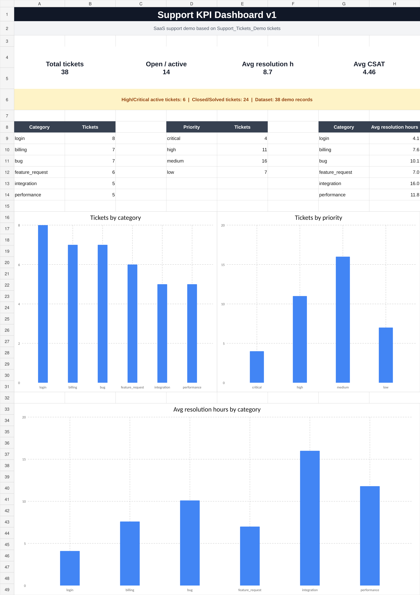

# Adrian Bryszewski — SaaS Support & AI Automation Portfolio

Customer support professional with more than 10 years of experience in customer service, sales and problem resolution. I am developing practical skills in SaaS Support, Technical Support, SQL, APIs, CRM processes, Power Automate and AI-assisted customer operations.

## Featured project

### AI-Assisted SaaS Support Workflow

A prototype support process that captures incoming customer emails, records tickets in Excel, classifies requests with a structured AI prompt, prepares draft replies and keeps a human responsible for final review.

[View the full case study](05_projects/project_1_support_ai_workflow.md)

<p align="center">
  
</p>

**Main evidence:**

- [Power Automate email-to-Excel workflow](02_power_automate/support_email_to_sheet_flow.md)
- [AI support automation blueprint](02_power_automate/ai_support_automation_blueprint.md)
- [Support KPI dashboard workbook](01_support_ticketing/Support_Tickets_Demo_KPI_Dashboard.xlsx)
- [Support process map](01_support_ticketing/support_process_map.png)
- [Customer support reply examples](01_support_ticketing/support_reply_examples.md)

## Additional portfolio work

### SaaS Customer Onboarding

A complete onboarding plan for a fictional real-estate CRM, including account setup, contact import, user roles, integrations, training, first-success metrics and a seven-day follow-up plan.

[View the SaaS onboarding checklist](01_support_ticketing/saas_onboarding_checklist.md)

### SQL and API Support Practice

SQL exercises based on fictional SaaS support tickets, plus API request, status-code and troubleshooting documentation.

[View the SQL and API section](03_sql_api/README.md)

### IT Support Foundations

Practical notes covering networking, DNS, DHCP, TCP/IP, Windows, Linux, permissions, logs and remote connection tools.

- [Networking fundamentals](04_it_support/networking_fundamentals_it_support.md)
- [Operating systems for IT Support](04_it_support/operating_systems_it_support.md)

## Skills demonstrated

```text
Customer Support
SaaS Support
Technical Troubleshooting
Power Automate
Workflow Automation
Excel
SQL
API Fundamentals
Postman
HTTP Status Codes
Customer Onboarding
Customer Success Processes
Technical Documentation
AI Prompt Design
Human-in-the-Loop Review
```

## Repository structure

```text
01_support_ticketing   Ticket data, dashboard, replies, onboarding and support processes
02_power_automate      Working automation, screenshots, prompts and AI workflow blueprint
03_sql_api             SQL exercises, API practice and troubleshooting case study
04_it_support          Networking and operating-system fundamentals
05_projects            Recruiter-facing project case studies
```

## About me

I bring long-term customer-facing experience from telecommunications and combine it with practical SaaS support, automation and technical troubleshooting projects. I am currently targeting remote opportunities in SaaS Support, Technical Support, Customer Onboarding, junior Customer Success and AI-assisted Support Operations.

## Contact

- LinkedIn: replace this line with your public LinkedIn URL
- GitHub: this repository
