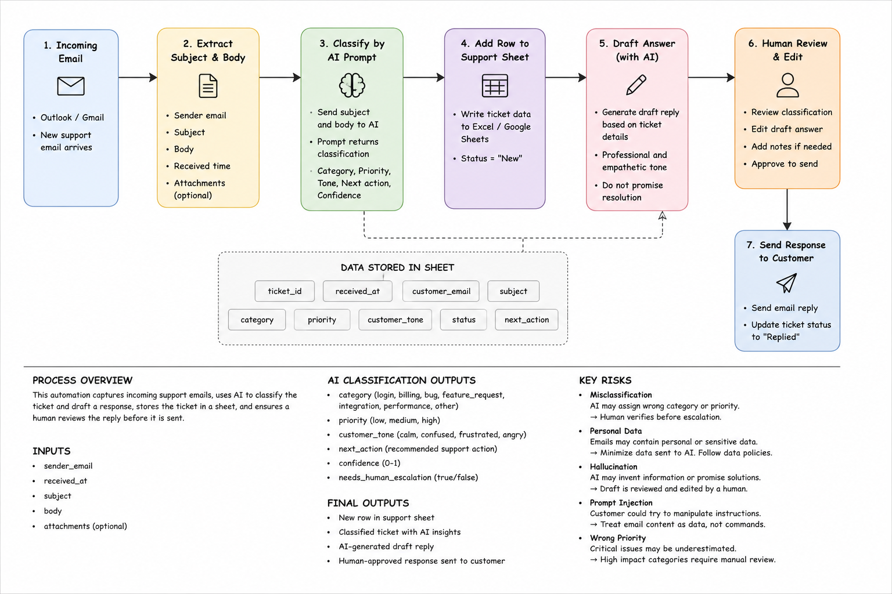

# Adrian Bryszewski — SaaS Support & AI Automation Portfolio

Customer support professional with more than 10 years of experience in customer service, sales and problem resolution.

I am developing practical skills in SaaS Support, Technical Support, SQL, APIs, Microsoft Power Automate and AI-assisted customer operations. This repository documents both my learning process and completed recruiter-facing portfolio projects.

## Featured portfolio projects

### 01 — AI-Assisted SaaS Support Workflow

A practical support workflow demonstrating how AI can assist with ticket classification, response preparation, escalation and support documentation while keeping a human responsible for the final decision.

The project includes:

- structured support ticket classification,
- reusable AI prompts,
- draft response preparation,
- escalation logic,
- human-in-the-loop review,
- workflow documentation.

[View the AI-Assisted SaaS Support Workflow](05_projects/01_ai_assisted_saas_support_workflow/)

<p align="center">
  
</p>

### 02 — Power Automate Support Ticket Automation

An automated support workflow built with Microsoft Power Automate.

The workflow processes incoming support emails, stores ticket information in Excel and OneDrive, applies conditional logic, routes requests with Switch actions, requests approvals and updates existing records.

The project also demonstrates:

- Outlook automation,
- Excel Online tables,
- OneDrive integration,
- Conditions and Switch,
- approval workflows,
- Update a row,
- retry policies,
- Configure run after,
- TRY/CATCH-style error handling.

[View the Power Automate Support Ticket Automation](05_projects/02_power_automate_support_ticket_automation/)

### 03 — SQL Support Reporting

A relational SQLite project containing 15 operational reports based on fictional SaaS support data.

The reports analyze:

- ticket categories,
- priority distribution,
- customer activity,
- ticket ownership,
- active workload,
- first response time,
- resolution time,
- monthly support performance.

[View the SQL Support Reporting project](05_projects/03_sql_support_reporting/)

## Main portfolio evidence

- [AI support automation blueprint](05_projects/01_ai_assisted_saas_support_workflow/ai_support_automation_blueprint.md)
- [AI support classification prompts](05_projects/01_ai_assisted_saas_support_workflow/prompts_support_classification.md)
- [Power Automate support ticket automation](05_projects/02_power_automate_support_ticket_automation/)
- [SQL support reporting project](05_projects/03_sql_support_reporting/)
- [Support KPI dashboard workbook](01_support_ticketing/artifacts/Support_Tickets_Demo_KPI_Dashboard.xlsx)
- [Support KPI dashboard preview](01_support_ticketing/artifacts/support_kpi_dashboard_v1.png)
- [Support process map](01_support_ticketing/artifacts/support_process_map.png)
- [Customer support reply examples](01_support_ticketing/learning/support_reply_examples.md)

## SaaS Support and Customer Success

This section contains practical materials related to customer communication, SaaS onboarding, support processes and KPI reporting.

### SaaS Customer Onboarding

A complete onboarding plan for a fictional real-estate CRM, including:

- initial account setup,
- contact import,
- user roles,
- integrations,
- customer training,
- first-success metrics,
- a seven-day follow-up plan.

[View the SaaS onboarding checklist](01_support_ticketing/learning/saas_onboarding_checklist.md)

### Support artifacts

The support artifacts section includes:

- a support KPI dashboard,
- a support process map,
- process documentation,
- operational support materials.

[View the SaaS Support and Customer Success section](01_support_ticketing/)

## Power Automate learning

Exercises covering:

- structured Excel tables,
- Outlook triggers,
- OneDrive,
- Conditions,
- Switch actions,
- approval workflows,
- Update a row,
- retry policies,
- Configure run after,
- workflow error handling,
- technical documentation.

[View the Power Automate section](02_power_automate/)

## SQL and API practice

SQL exercises based on fictional SaaS support tickets, together with API request, status-code and troubleshooting documentation.

Topics include:

- `SELECT`,
- `WHERE`,
- filtering and sorting,
- SQL joins,
- `GROUP BY`,
- aggregate functions,
- `HAVING`,
- REST API fundamentals,
- HTTP status codes,
- Postman,
- OpenAPI,
- API troubleshooting.

[View the SQL and API section](03_sql_api/)

## IT Support foundations

Practical notes covering networking, operating systems and technical troubleshooting.

### Networking

Topics include:

- IP addressing,
- DNS,
- DHCP,
- TCP and UDP,
- routers and switches,
- connectivity troubleshooting,
- common networking commands.

[View Networking Fundamentals](04_it_support/learning/networking_fundamentals_it_support.md)

### Operating systems

Topics include:

- Windows fundamentals,
- Linux fundamentals,
- users and permissions,
- processes and services,
- files and folders,
- software installation,
- logs,
- remote connection tools,
- operating-system troubleshooting.

[View Operating Systems for IT Support](04_it_support/learning/operating_systems_it_support.md)

## Skills demonstrated

```text
Customer Support
SaaS Support
Technical Support
Technical Troubleshooting
Customer Onboarding
Customer Success Processes
Support Ticket Analysis
Microsoft Power Automate
Workflow Automation
Outlook Automation
Excel Online
OneDrive
Approval Workflows
Error Handling
SQL
SQLite
Relational Databases
API Fundamentals
REST APIs
Postman
HTTP Status Codes
OpenAPI
Networking Fundamentals
Operating Systems
Technical Documentation
AI Prompt Design
AI-Assisted Support
Human-in-the-Loop Review
Git
GitHub
```

## Repository structure

```text
01_support_ticketing/
├── learning/                SaaS Support and Customer Success exercises
└── artifacts/               KPI dashboard, process map and support materials

02_power_automate/
└── learning/                Power Automate exercises from D33 to D37

03_sql_api/
└── learning/                SQL and API exercises and documentation

04_it_support/
└── learning/                Networking and operating-system fundamentals

05_projects/
├── 01_ai_assisted_saas_support_workflow/
├── 02_power_automate_support_ticket_automation/
└── 03_sql_support_reporting/
```

## About me

I bring more than 10 years of customer-facing experience from the telecommunications industry and combine it with practical SaaS Support, automation, SQL reporting and technical troubleshooting projects.

I am currently targeting remote opportunities in:

- SaaS Support,
- Technical Support,
- Product or Application Support,
- Customer Onboarding,
- Junior Customer Success,
- AI-assisted Support Operations.

## Contact

- LinkedIn: [linkedin.com/in/adrian-bryszewski](https://www.linkedin.com/in/adrian-bryszewski/)
- GitHub: this repository
